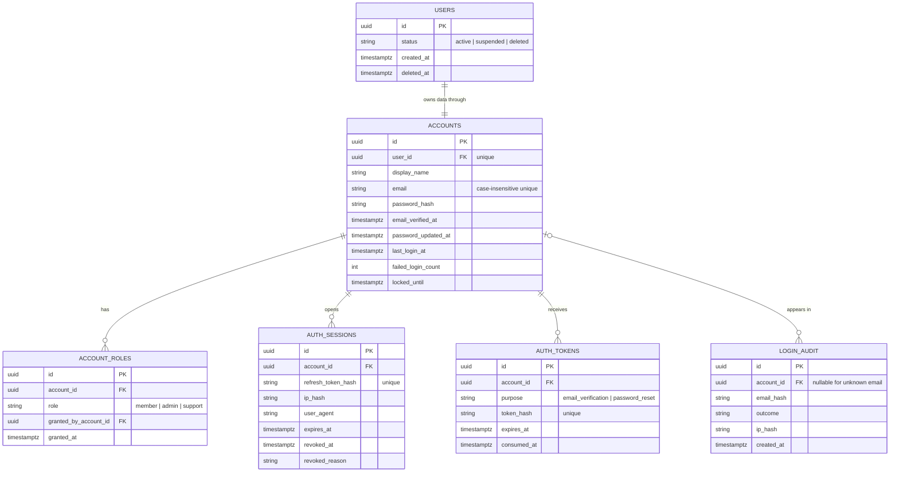

# Auth and Account Database Design

## Purpose and boundary

This design separates the authenticated account from the pseudonymous `users` record that owns skin, health, image-analysis, and consent data. An account has exactly one user record in the present product, but account credentials and security events must never be copied into health tables.

The design supports local email/password authentication now, plus secure sessions, email verification, password reset, administrative roles, and auditability. It deliberately does not store raw access tokens, refresh tokens, passwords, or IP addresses.

## ER diagram

## Table rules

| Table | Key rules | Retention and privacy |
|---|---|---|
| `users` | A data owner; `accounts.user_id` is unique. Soft-delete the user first, then complete deletion through the privacy workflow. | Does not contain credentials or direct contact details. |
| `accounts` | Email is normalized to lowercase by the API and enforced with a database unique expression index. Password is a salted, slow hash only. | Keep only needed contact/profile data. |
| `account_roles` | `(account_id, role)` is unique. New accounts receive `member` explicitly at registration. | Roles are authorization data, not an `is_admin` flag. |
| `auth_sessions` | One row per device/browser session. Refresh tokens are opaque random values and only their SHA-256/HMAC hash is stored. | Delete expired/revoked sessions on a scheduled retention job. |
| `auth_tokens` | `purpose` is constrained and a token becomes invalid after `consumed_at` or `expires_at`. | Store only the token hash; purge consumed/expired tokens. |
| `login_audit` | Failed attempts may have no account ID, but retain a keyed hash of the normalized email for rate limiting. | Hash IP using a server-side keyed HMAC; do not retain raw IP or passwords. |

## Authentication flows

1. **Sign-up**: create `users`, `accounts`, one `account_roles(member)`, the required consent rows, then an `auth_tokens(email_verification)` row. Send only the unpersisted token value.
2. **Login**: lock the account row, reject `users.status != active` or a current `locked_until`, verify the password hash, record `login_audit`, reset or increment failed attempts, and create `auth_sessions` with a new refresh-token hash.
3. **Refresh**: locate a non-revoked, non-expired session by hash, rotate the refresh token in the same transaction, update `last_seen_at`, and issue a short-lived access JWT with `sub=user_id`, `sid=session_id`, and roles.
4. **Logout or password reset**: set `revoked_at` for the relevant session(s). On a successful reset, revoke every session, replace `password_hash`, and set `password_updated_at`.
5. **Email verification/reset**: consume the token with an atomic `WHERE consumed_at IS NULL AND expires_at > now()` update. A token may only be used once.

## Constraints and indexes

The SQLAlchemy schema enforces foreign keys, account-email uniqueness, role uniqueness, token purpose, and indexes for account/session/token lookups. The active-session composite index makes logout-all and refresh validation efficient; login audit is indexed by account and time.

Use PostgreSQL transactions with row locking for login counters, token consumption, and refresh-token rotation. `Base.metadata.create_all()` creates these tables in a new local database. A deployed database needs a reviewed Alembic migration (or equivalent) because `create_all()` never alters existing tables.

## Security decisions

- Access JWTs remain short-lived and contain no email, password, health, or consent details.
- Refresh tokens and one-time tokens are random secrets; database compromise must not make them reusable.
- Email verification is separate from consent. Consent records stay in `consents` because they govern health/analysis processing, not identity proof.
- Do not make a medical decision from account state or audit data.
- Enforce authorization from `account_roles` server-side; never trust a role supplied by a client.
