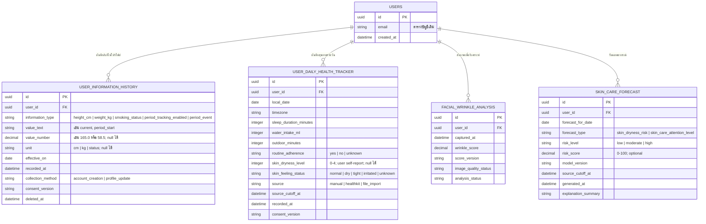

# ER Diagram: Facial Analysis แยกจาก Health & Skin-Care Forecast

## แนวคิดผลิตภัณฑ์

Aphrodize มี 2 ความสามารถที่แยกกันชัดเจน:

1. **Facial wrinkle analysis (non-time-series)** — วิเคราะห์ภาพใบหน้าแต่ละครั้งเพื่อแสดงริ้วรอยจากภาพนั้น เป็นผลการวิเคราะห์ภาพแบบจุดเวลาเดียว ไม่ใช่โมเดล health tracker
2. **Health & skin-care tracker (time series)** — ให้ผู้ใช้บันทึกไลฟ์สไตล์รายวัน เช่น การนอน การดื่มน้ำ และเวลานอกอาคาร แล้วพยากรณ์สัญญาณการดูแลผิวของวันถัดไป เช่น ความเสี่ยงที่ผู้ใช้อาจรายงานว่า “ผิวแห้ง”

โมเดล time series รุ่นแรกต้องไม่พยากรณ์ว่าเกิด “ผิวเสีย” หรือโรคผิวหนัง เพราะต้องใช้หลักฐานและการตรวจสอบทางคลินิกมากกว่านี้ ชื่อผลลัพธ์ที่ปลอดภัยสำหรับรุ่นแรกคือ `skin_dryness_risk` หรือ `skin_care_attention_level` ซึ่งหมายถึงสัญญาณจากประวัติที่ผู้ใช้บันทึก ไม่ใช่การวินิจฉัยหรือคำแนะนำรักษา

## ขอบเขตข้อมูลที่ผู้ใช้กรอก: 2 ตารางหลัก

ข้อมูลที่ผู้ใช้กรอกเองมีเพียง 2 ตารางหลัก:

| ตาราง | ข้อมูลที่เก็บ | ใช้กับอะไร |
|---|---|---|
| `user_information_history` | ข้อมูลตอนสร้างบัญชีและการแก้ไขภายหลัง เช่น ส่วนสูง น้ำหนัก สถานะสูบบุหรี่ การเปิดติดตามประจำเดือน | โปรไฟล์/บริบทของผู้ใช้ และการจัดการ consent; ไม่ใช่ target รายวันของโมเดลรุ่นแรก |
| `user_daily_health_tracker` | ข้อมูลรายวัน เช่น ชั่วโมงนอน น้ำดื่ม เวลานอกอาคาร routine และสถานะผิวแห้งที่ผู้ใช้ตอบ | input และ target ของโมเดล time series |

`facial_wrinkle_analysis` และ `skin_care_forecast` เป็นผลลัพธ์ที่ระบบสร้าง ไม่ใช่ตารางที่ผู้ใช้กรอกเพิ่ม

## ER Diagram



## เส้นทางข้อมูลของแต่ละฟีเจอร์

```text
A. Facial wrinkle analysis — แยกจาก time series

ผู้ใช้ถ่ายภาพ
      ↓
facial_wrinkle_analysis
      ↓
แสดง wrinkle_score ของภาพนั้นบน dashboard


B. Health & skin-care time series

ผู้ใช้สร้างบัญชี/แก้โปรไฟล์
      ↓
user_information_history
      ↓
ผู้ใช้บันทึกไลฟ์สไตล์และความรู้สึกผิวทุกวัน
      ↓
user_daily_health_tracker
      ↓
feature snapshot (สร้างชั่วคราวจากข้อมูลย้อนหลัง)
      ↓
skin_care_forecast ของวันถัดไป
```

ในรุ่นแรก `facial_wrinkle_analysis` ไม่เป็น input ของ `skin_care_forecast` เพื่อป้องกันไม่ให้โมเดล non-time-series กับ health tracker ถูกปะปนกัน หากอนาคตต้องการใช้แนวโน้มจากภาพเป็นฟีเจอร์ใหม่ ต้องมีแผน versioning, consent และ evaluation แยกต่างหาก

## ตารางที่ 1: `user_information_history`

ใช้กับข้อมูลที่มีผลในช่วงเวลาหนึ่ง และอาจถูกผู้ใช้แก้ไขในอนาคต ทุกการแก้ไขเพิ่มแถวใหม่ ห้ามเขียนทับแถวเก่า เพื่อให้ทราบว่าระบบรู้ข้อมูลใด ณ เวลาใด

| `information_type` | ตัวอย่างค่า | เก็บเมื่อใด | บทบาทในรุ่นแรก |
|---|---|---|---|
| `height_cm` | `value_number = 165`, `unit = cm` | สมัครบัญชี/แก้โปรไฟล์ | บริบทโปรไฟล์เท่านั้น |
| `weight_kg` | `value_number = 58.5`, `unit = kg` | สมัครบัญชี/แก้โปรไฟล์ | ประวัติสุขภาพส่วนบุคคล; ยังไม่ใช่ฟีเจอร์ daily forecast โดยอัตโนมัติ |
| `smoking_status` | `current`, `not_current`, `unknown` | สมัครบัญชี/แก้โปรไฟล์ | บริบทโปรไฟล์; ค่าคงที่ไม่ใช้ทำนายรายวันของคนเดียว |
| `period_tracking_enabled` | `yes`, `no` | สมัครบัญชี/ตั้งค่า | consent toggle สำหรับเหตุการณ์ประจำเดือน |
| `period_event` | `period_start`, `period_end`, `unknown` | ผู้ใช้ยืนยันภายหลัง | เก็บเมื่อ opt-in เท่านั้น; ห้ามอนุมานรอบเดือน การตั้งครรภ์ หรือภาวะเจริญพันธุ์ |

## ตารางที่ 2: `user_daily_health_tracker`

ตารางนี้คือแกนกลางของ health tracker หนึ่งแถวต่อผู้ใช้ต่อวันท้องถิ่น โดยใช้ unique key: `user_id + local_date`

| กลุ่ม | ฟิลด์ | ความหมาย | ใช้กับ forecast |
|---|---|---|---|
| การนอน | `sleep_duration_minutes` | นาทีที่หลับทั้งหมดตามนิยามเดียวกัน | `sleep_duration_minutes_lag_1` |
| น้ำดื่ม | `water_intake_ml` | ปริมาณน้ำรวมในวันนั้น | `water_intake_ml_lag_1` |
| สภาพแวดล้อม | `outdoor_minutes` | เวลานอกอาคารที่ผู้ใช้ยืนยัน | `outdoor_minutes_lag_1` |
| กิจวัตรดูแลผิว | `routine_adherence` | ทำ routine ที่ตั้งไว้หรือไม่ | `routine_adherence_lag_1` เมื่อเปิดใช้ |
| target ที่ผู้ใช้รายงาน | `skin_dryness_level` | ระดับความแห้งที่ผู้ใช้รู้สึก: `0` ไม่แห้ง ถึง `4` แห้งมาก | target สำหรับเรียนรู้ความเสี่ยงผิวแห้งวันถัดไป |
| target แบบคำอธิบาย | `skin_feeling_status` | `normal`, `dry`, `tight`, `irritated`, `unknown` | ใช้แสดง/ตรวจสอบความสอดคล้อง; เริ่มจาก `dry` เป็น target หลักก่อน |
| เวลาและที่มา | `source_cutoff_at`, `recorded_at`, `source` | ระบบรู้ข้อมูลเมื่อใดและมาจากไหน | ป้องกันข้อมูลอนาคตรั่วเข้าโมเดล |

ค่า `skin_dryness_level` เป็นการรายงานความรู้สึกของผู้ใช้ ไม่ใช่การวินิจฉัยโรค การเก็บ target นี้จำเป็น เพราะโมเดลจะเรียนรู้ “มีความเสี่ยงที่ผู้ใช้อาจรายงานความแห้งในวันถัดไป” ไม่ใช่เดาความเสี่ยงจากการนอนและน้ำโดยไม่มีผลลัพธ์จริงให้เรียนรู้

## ความสัมพันธ์ในการสร้าง forecast

ไม่มี foreign key โดยตรงระหว่าง `user_information_history` กับ `user_daily_health_tracker` ทั้งสองตารางเชื่อมกลับไปที่ `users.id` และงาน feature builder จับคู่ข้อมูลด้วย `user_id` กับวันท้องถิ่น

| ขั้นตอน | กติกา | ผลลัพธ์ |
|---|---|---|
| 1. ระบุผู้ใช้ | `history.user_id = daily.user_id = users.id` | ใช้เฉพาะข้อมูลของผู้ใช้คนเดียวกัน |
| 2. เลือกประวัติที่ใช้ได้ | `effective_on <= local_date` และ `recorded_at <= source_cutoff_at` | ใช้เฉพาะข้อมูลที่ระบบทราบทันเวลา |
| 3. สร้าง input แบบ lag | ใช้ daily data ของวัน *t* | สร้าง `sleep_lag_1`, `water_lag_1`, `outdoor_lag_1`, `routine_lag_1` เพื่อทำนายวัน *t + 1* |
| 4. สร้าง target | ใช้ `skin_dryness_level` หรือสถานะ `dry` ของวัน *t + 1* | ใช้ฝึกและวัดความแม่นยำของ forecast |
| 5. สร้างผลลัพธ์ | บันทึก `skin_care_forecast` พร้อม model version และ cutoff | แสดง risk ของวันถัดไปและคำอธิบายแบบไม่เป็นการแพทย์ |

ตัวอย่าง:

```text
ข้อมูลวันที่ 10 ต.ค.
  sleep_duration_minutes = 360
  water_intake_ml        = 900
  outdoor_minutes        = 90
  routine_adherence      = no
                 ↓
forecast สำหรับวันที่ 11 ต.ค.
  forecast_type          = skin_dryness_risk
  risk_level             = moderate
  explanation_summary    = "รูปแบบการนอนและน้ำดื่มล่าสุดต่างจากวันที่ผู้ใช้รายงานผิวปกติ"
```

คำอธิบายต้องกล่าวว่าเป็นรูปแบบที่โมเดลพบในข้อมูลของผู้ใช้ ไม่ใช่ข้อความว่า “การนอนน้อยทำให้ผิวเสีย” หรือ “ดื่มน้ำน้อยทำให้เกิดโรคผิวหนัง”

## โมเดลและเกณฑ์ประเมิน

### รุ่นเริ่มต้น

| ส่วน | ข้อกำหนด |
|---|---|
| เป้าหมาย | `skin_dryness_level` ของวันถัดไป หรือ binary `dry`/`not_dry` ที่ผู้ใช้ยืนยัน |
| Input | lagged sleep, water, outdoor และ routine เท่านั้น |
| ประวัติขั้นต่ำ | 30 วันต่อเนื่องที่มี target และ input หลักครบ |
| เปรียบเทียบ | baseline ที่ใช้ target วันก่อนหน้า เทียบกับ lifestyle model |
| ตัวชี้วัด | MAE สำหรับระดับ 0–4; หรือ precision/recall และ calibration สำหรับ target แบบ risk class |
| ผลลัพธ์ที่แสดง | low/moderate/high พร้อมข้อความจำกัดความหมาย และ coverage ของข้อมูล |

### ฟีเจอร์ที่ยังไม่ใส่ในรุ่นแรก

- ค่าคงที่จากโปรไฟล์ เช่น ส่วนสูง น้ำหนัก หรือ smoking status ไม่ใช้เป็น input time series รายบุคคล
- ข้อมูลประจำเดือนจะเข้ามาได้เมื่อผู้ใช้ opt-in, มีเหตุการณ์ที่ยืนยัน และผ่าน privacy/evaluation gate แยก
- ข้อมูลจาก facial wrinkle analysis ไม่ใช้เป็น input ของ health forecast รุ่นแรก
- ห้ามใช้ตำแหน่ง GPS ละเอียด, diagnosis, medication, raw biometric stream หรือข้อมูลที่อนุมานภาวะสุขภาพ

## กติกาความเป็นส่วนตัวและ UX

- ผู้ใช้สร้างบัญชีและใช้ health tracker ได้แม้ไม่ตอบ smoking หรือไม่เปิด period tracking
- แยก consent สำหรับข้อมูลอ่อนไหว และเปิดให้แก้/ลบข้อมูลได้จาก Profile & Privacy
- `null`, `unknown`, `not_current` และ `not_dry` มีความหมายต่างกัน ห้ามแทนกัน
- ไม่ส่ง notification เชิงเร่งด่วนหรือคำแนะนำทางการแพทย์จาก forecast
- ข้อความ UI ที่แนะนำ: “จากรูปแบบที่คุณบันทึกล่าสุด ระบบคาดว่าพรุ่งนี้อาจมีความเสี่ยงผิวแห้งเพิ่มขึ้น โปรดติดตามความรู้สึกผิวของคุณ”
- ข้อความ UI ที่ห้ามใช้: “คุณจะผิวเสีย”, “คุณเป็นโรคผิวหนัง”, “คุณต้องดื่มน้ำ/นอนตามจำนวนที่ระบบกำหนด”

## งานที่ต้องตัดสินใจก่อนพัฒนา

1. สเกล `skin_dryness_level` จะใช้ 0–4 ตามแผน หรือใช้คำตอบง่าย ๆ `normal`/`dry` ใน MVP?
2. จะถาม target ผิวแห้งเวลาใดของวัน เพื่อให้สอดคล้องกับข้อมูลนอน น้ำ และ outdoor?
3. `routine_adherence` ใน MVP จะเป็น yes/no หรือจะแยกขั้นตอน routine โดยละเอียด?
4. ผล forecast จะอยู่ใน dashboard อย่างเดียว หรือส่ง reminder แบบที่ผู้ใช้เลือกเปิดเอง?
5. เมื่อมีข้อมูลครบ 30 วัน จะใช้ MAE (ระดับ 0–4) หรือใช้ classification metrics (normal/dry) เป็นเกณฑ์หลัก?
6. ใครอนุมัติข้อความ UX, privacy consent และเกณฑ์นำโมเดลออกใช้งาน?
