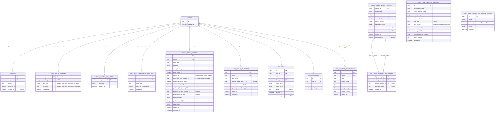

# ER Diagram: Current User, Daily Health, and Skin-Analysis Data

เอกสารนี้อธิบาย **schema ที่มีอยู่ในโปรเจกต์ปัจจุบัน** โดยยึด SQLAlchemy models ใน `backend/core/db/models.py` เป็นแหล่งอ้างอิง ไม่ใช่ schema ที่วางแผนไว้สำหรับอนาคต

## ขอบเขตระบบ

Aphrodize แยกงานหลักออกเป็นสองสาย:

1. **วิเคราะห์ภาพใบหน้า (non-time-series):** คำขอวิเคราะห์ภาพและผลอยู่ใน `analyses`; object ของภาพอยู่ใน object storage และอ้างด้วย `object_key`
2. **Daily health tracker (time-series):** input รายวัน คะแนนจากโมเดล และผลสุขภาพที่ผู้ใช้รายงานจริงจัดเก็บใน `daily_health_entries` และ `daily_health_outcomes`; โปรไฟล์และข้อมูลอ่อนไหวแยกเป็นตารางที่ตรวจ consent ได้

ฐานข้อมูลจึงไม่ได้ใช้ตารางกว้างเพียงสองตาราง: ข้อมูลบัญชี, consent, โปรไฟล์, เช็กอินรายวัน, prediction และ outcome แยกตามหน้าที่ เพื่อแยกค่าที่โมเดลทำนายออกจากค่าที่ผู้ใช้รายงานจริง

## ER Diagram ของตารางผู้ใช้และ Daily Health


```mermaid
erDiagram
    USERS ||--o{ CONSENTS : "ให้หรือถอนความยินยอม"
    USERS ||--o| DAILY_HEALTH_PROFILES : "บริบทโปรไฟล์ที่ consent แล้ว"
    USERS ||--o| DAILY_HEALTH_AGE_BANDS : "ช่วงวัยเมื่อยินยอม"
    USERS ||--o{ DAILY_HEALTH_MENSTRUAL_CHECKINS : "เช็กอินรายวันเมื่อ opt-in"
    USERS ||--o{ DAILY_HEALTH_ENTRIES : "input รายวันและคะแนน prediction"
    USERS ||--o{ DAILY_HEALTH_OUTCOMES : "ผลที่ผู้ใช้รายงานจริง"
    USERS ||--o{ ANALYSES : "คำขอวิเคราะห์ภาพ"
    USERS ||--o{ QUESTIONNAIRES : "คำตอบแบบสอบถาม"
    USERS ||--o{ DAILY_LIFESTYLE_OBSERVATIONS : "ข้อมูล wrinkle/lifestyle อีกเส้นทางหนึ่ง"
    DAILY_HEALTH_MODEL_VERSIONS o|--o{ DAILY_HEALTH_MODEL_DEPLOYMENTS : "active_version_id"
    DAILY_HEALTH_MODEL_VERSIONS o|--o{ DAILY_HEALTH_MODEL_DEPLOYMENTS : "previous_version_id"

    USERS {
        uuid id PK
        datetime created_at
    }
    CONSENTS {
        uuid id PK
        uuid user_id FK
        string version
        datetime accepted_at
        datetime revoked_at "nullable"
    }
    DAILY_HEALTH_PROFILES {
        uuid user_id PK "FK users.id"
        string smoking_status "nullable"
        string skin_type "nullable; separately consented self-report"
        float weight_kg "nullable; separately consented profile value"
        datetime updated_at
    }
    DAILY_HEALTH_AGE_BANDS {
        uuid user_id PK "FK users.id"
        string age_band
        datetime updated_at
    }
    DAILY_HEALTH_MENSTRUAL_CHECKINS {
        uuid id PK
        uuid user_id FK
        date local_date
        boolean currently_menstruating
        datetime created_at
    }
    DAILY_HEALTH_ENTRIES {
        uuid id PK
        uuid user_id FK
        date local_date
        string timezone
        integer sleep_duration_minutes
        integer water_intake_ml
        float weight_kg "nullable profile-weight snapshot"
        float calculated_thirst_score_0_10 "nullable; server calculated"
        integer outdoor_exposure_choice
        float sleep_score_0_100
        float predicted_thirst_score_0_10 "nullable"
        float predicted_dryness_score_0_10 "nullable"
        date prediction_target_date "nullable"
        string prediction_status
        string prediction_model_id "nullable"
        string data_source
        datetime created_at
        datetime updated_at
    }
    DAILY_HEALTH_OUTCOMES {
        uuid id PK
        uuid user_id FK
        date target_date
        float reported_energy_level_0_10 "nullable"
        float reported_thirst_level_0_10 "nullable"
        float reported_dryness_level_0_10 "nullable"
        datetime created_at
        datetime updated_at
    }
    DAILY_HEALTH_DATASET_RECORDS {
        uuid id PK
        string dataset_fingerprint
        string source_dataset_name
        integer source_row_number
        string participant_key "nullable"
        date local_date "nullable"
        string data_source "observed | synthetic | unknown"
        string generation_rule_version "nullable"
        boolean training_eligible
        string training_exclusion_reason
        json record_payload
        datetime imported_at
    }
    DAILY_HEALTH_MODEL_VERSIONS {
        string version_id PK
        string model_family
        string status
        string dataset_fingerprint UK
        integer training_records
        integer participant_count
        string artifact_uri "nullable"
        json metrics "nullable"
        datetime created_at
        datetime completed_at "nullable"
    }
    DAILY_HEALTH_MODEL_DEPLOYMENTS {
        string deployment_key PK
        string active_version_id FK "nullable"
        string previous_version_id FK "nullable"
        string approval_reason "nullable"
        datetime updated_at
    }
    DAILY_HEALTH_MODEL_DEPLOYMENT_EVENTS {
        uuid id PK
        string action
        string version_id "nullable; no FK constraint"
        string reason
        datetime created_at
    }
    ANALYSES {
        uuid id PK
        uuid user_id FK
        string status
        string object_key UK
        string model_family
        string model_version
        json result "nullable"
        datetime created_at
        datetime completed_at "nullable"
    }
    QUESTIONNAIRES {
        uuid id PK
        uuid user_id FK
        json answers
        datetime created_at
    }
    DAILY_LIFESTYLE_OBSERVATIONS {
        uuid id PK
        uuid user_id FK
        date date
        float wrinkle_score
        float sleep_hours
        float water_intake_ml
        float outdoor_minutes
        datetime created_at
    }
```

ข้อกำหนด unique ที่แสดงใน diagram แบบ composite:

- `daily_health_entries`: หนึ่งแถวต่อ `(user_id, local_date)`
- `daily_health_outcomes`: หนึ่งแถวต่อ `(user_id, target_date)`
- `daily_health_menstrual_checkins`: หนึ่งแถวต่อ `(user_id, local_date)`
- `daily_lifestyle_observations`: หนึ่งแถวต่อ `(user_id, date)`
- `daily_health_dataset_records`: หนึ่งแถวต่อ `(dataset_fingerprint, source_row_number)`

## หน้าที่และความสัมพันธ์ของข้อมูล

### 1. ข้อมูลส่วนตัวและ consent

| ตาราง | สิ่งที่เก็บ | ความสัมพันธ์/ข้อควรทราบ |
|---|---|---|
| `users` | UUID และเวลาสร้างบัญชี | เป็นเจ้าของข้อมูลรายผู้ใช้; ตารางนี้ไม่มี email หรือวันเกิดใน schema ปัจจุบัน |
| `consents` | consent version, เวลายอมรับและเวลาถอน | หนึ่ง user มีหลาย consent; active consent ถูกตรวจโดย application ตาม `version` และ `revoked_at` |
| `daily_health_profiles` | `smoking_status`, `skin_type`, `weight_kg` ปัจจุบัน | หนึ่งแถวต่อ user; เป็นค่าปัจจุบัน ไม่ใช่ประวัติเปลี่ยนแปลงแบบ append-only; skin type และน้ำหนักมี consent แยกและจะถูกใช้เฉพาะเมื่อ consent ที่ตรงกันยัง active; น้ำหนักใช้คำนวณ thirst เท่านั้น |
| `daily_health_age_bands` | `age_band` | หนึ่งแถวต่อ user; เก็บเป็นช่วงวัย ไม่เก็บวันเกิด และใช้ได้เมื่อ age-guidance consent active |
| `daily_health_menstrual_checkins` | การยืนยันว่ากำลังมีประจำเดือนใน `local_date` | เก็บแยกตามวันและเป็น optional; ใช้ได้เมื่อ personalization consent active |

ส่วนสูงยังไม่มี field/table สำหรับเก็บใน schema ปัจจุบัน; น้ำหนักเก็บเป็นค่าปัจจุบันใน `daily_health_profiles` และบันทึกเป็น snapshot เฉพาะวันที่ consent ยัง active เพื่อให้คำนวณ thirst ย้อนหลังได้ น้ำหนักใน snapshot ไม่ใช่การกรอกข้อมูลรายวัน

### 2. Daily inputs, predictions และผลจริง

`daily_health_entries` คือบันทึก input ประจำวัน รวมถึง `sleep_duration_minutes`, `water_intake_ml`, outdoor choice, น้ำหนักโปรไฟล์ที่ใช้เป็น snapshot (`weight_kg`), คะแนน thirst ที่ server คำนวณ, คะแนน sleep ที่ระบบคำนวณ และคะแนน dryness ที่โมเดลทำนาย (nullable เมื่อไม่มี prediction) ค่า sleep score ปัจจุบันคำนวณจากระยะเวลานอน โดย 9 ชั่วโมงเป็นเพดานคะแนน 100

`prediction_model_id` เป็น string metadata ใน entry ไม่ใช่ foreign key ไปยัง `daily_health_model_versions`; การผูกผลกับรุ่นโมเดลจึงเป็นข้อมูลอ้างอิง ไม่ใช่ข้อบังคับเชิง relational constraint

ค่า outdoor เป็นรหัสตัวเลือก `1–4` ไม่ใช่นาทีจริง; mapping ในฟอร์ม/backend ปัจจุบันคือ `<60`, `60–<180`, `180–<240` และ `>=240` นาทีตามลำดับ

`daily_health_outcomes` เก็บ self-report สำหรับวันเป้าหมายแยกจาก prediction ได้แก่พลังงาน ความกระหาย และความแห้ง โดยมี unique key `(user_id, target_date)`. การจับคู่กับ input สำหรับฝึกเป็น **logical join** ด้วย user คนเดิมและ `outcome.target_date = entry.local_date + 1 วัน`; ไม่มี foreign key โดยตรงระหว่างสองตาราง

`daily_health_entries` ยังมีคอลัมน์ nullable `reported_thirst_score_0_10` และ `reported_dryness_score_0_10` แต่ flow self-report ปัจจุบันบันทึกผลลง `daily_health_outcomes`; จึงให้ถือ `daily_health_outcomes` เป็นตารางหลักของ observed outcome

การตีความความเสี่ยงที่หน้าเว็บแสดง (สุขภาพโดยรวม, ผิวแห้ง/การดูแลผิว, สิว, พลังงานวันถัดไป, กระหายน้ำวันถัดไป และคำแนะนำตามข้อมูลส่วนตัว) **ไม่ได้เก็บเป็นตาราง forecast แยก**: API สร้าง interpretation จาก input, คะแนนที่บันทึก และบริบทที่ consent อนุญาตเมื่อส่ง/อ่านผล คำแนะนำจาก `skin_type` เป็นกฎทั่วไปและไม่เปลี่ยนผลหรือคะแนนของโมเดล

### 3. ชุดข้อมูลนำเข้าและ lifecycle ของโมเดล

- `daily_health_dataset_records` เก็บ provenance ของแถว dataset ที่ import เช่น fingerprint, ชื่อไฟล์, ลำดับแถว, แหล่งข้อมูลและ payload JSON; ไม่มี `user_id` foreign key และไม่เชื่อมผู้เข้าร่วมจากไฟล์กลับไปยังบัญชีจริงโดยตรง
- `daily_health_model_versions` เก็บ metadata, metrics, fingerprint และตำแหน่ง artifact ของแต่ละรุ่น; fingerprint ไม่ซ้ำ
- `daily_health_model_deployments` เก็บรุ่น active/previous ที่ผู้ดูแลอนุมัติ; ทั้งสอง version ID เป็น foreign key ไปยังรุ่นโมเดล
- `daily_health_model_deployment_events` เป็น audit log; `version_id` เป็น string แต่ไม่มี FK constraint ใน schema ปัจจุบัน
- การฝึก user candidate ใช้ daily inputs ที่เข้าเกณฑ์และผลที่ผู้ใช้รายงานจริงภายใต้ model-training consent; prediction score ไม่ใช่ training label

### 4. วิเคราะห์ภาพและตารางอื่นที่ยังมีอยู่

- `analyses` คือคำขอวิเคราะห์ภาพจริงใน schema ปัจจุบัน; ผลและ metadata โมเดลอยู่ในแถวเดียวกัน ส่วนไฟล์ภาพอยู่ใน object storage ผ่าน `object_key`. จึงไม่มีตาราง `facial_wrinkle_analysis` แยก
- `daily_lifestyle_observations` เป็นเส้นทางข้อมูล wrinkle/lifestyle ที่ยังมี endpoint `/forecasts` ของตนเอง แยกจาก `daily_health_entries` และไม่ใช่ source ของ training service ใน Daily Health ecosystem
- `questionnaires` เก็บคำตอบแบบ JSON ของผู้ใช้
- ตารางงานทั่วไป `training_runs` และ `inference_runs` ใช้เก็บ job ของระบบและไม่มี FK ไปยัง user; ไม่แสดงใน diagram หลักนี้เพราะไม่ใช่ข้อมูล collection รายผู้ใช้

## ชื่อจาก ER แบบเดิมที่ไม่ใช่ตารางปัจจุบัน

| ชื่อเชิงแนวคิดเดิม | schema ปัจจุบัน |
|---|---|
| `user_information_history` | แยกเป็น `consents`, `daily_health_profiles`, `daily_health_age_bands` และ `daily_health_menstrual_checkins`; profile/age เป็นค่าปัจจุบัน ไม่ใช่ประวัติทุก version |
| `user_daily_health_tracker` | แทนด้วย `daily_health_entries` สำหรับ input/prediction และ `daily_health_outcomes` สำหรับผล self-report |
| `facial_wrinkle_analysis` | ใช้ตาราง `analyses` |
| `skin_care_forecast` | ไม่มีตารางแยก; score อยู่ใน `daily_health_entries` และ risk interpretation สร้างใน API |

## ภาพรวมเส้นทางข้อมูล

```text
consents + (optional) profile / age band / menstrual check-in
                         │
                         ├── ให้บริบทเฉพาะบุคคลเมื่อ consent ยัง active
                         ▼
user → daily_health_entries (หนึ่งรายการต่อ user/local date)
                         │
                         ├── เก็บ input + predicted thirst/dryness แยกจาก label จริง
                         │
                         └── จับคู่เชิงตรรกะกับ daily_health_outcomes ของวันเป้าหมายถัดไป
                                      │
                                      └── ใช้ train candidate เมื่อมี model-training consent

ภาพใบหน้า → analyses → result/model metadata (ไม่เชื่อมเข้า Daily Health time series)
```

รายละเอียด flow/API การกรอกข้อมูลและการอ่านผลบนหน้า Overview/Trend อยู่ที่ [`Daily-Health-Input-Flow.md`](Daily-Health-Input-Flow.md)
