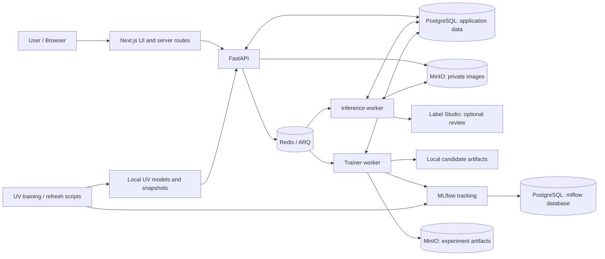
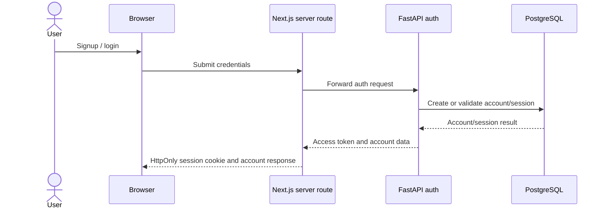
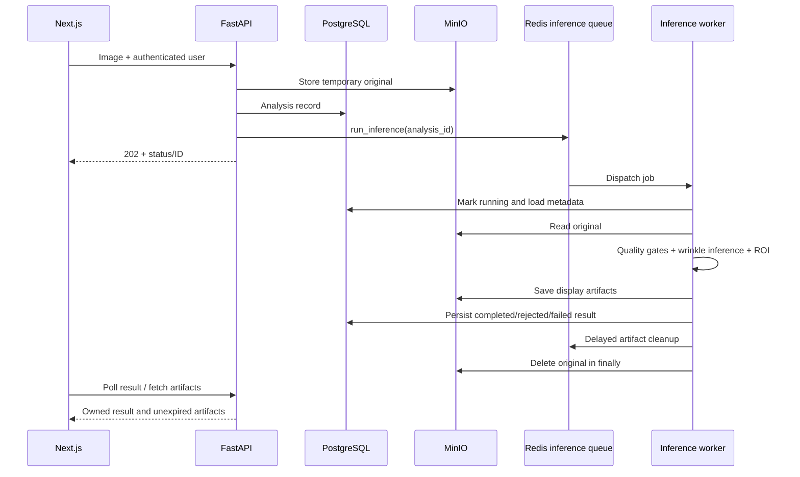
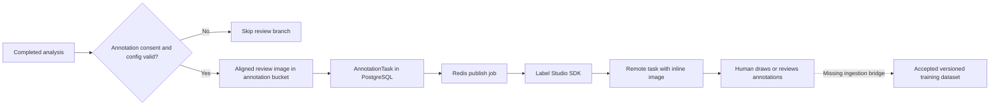
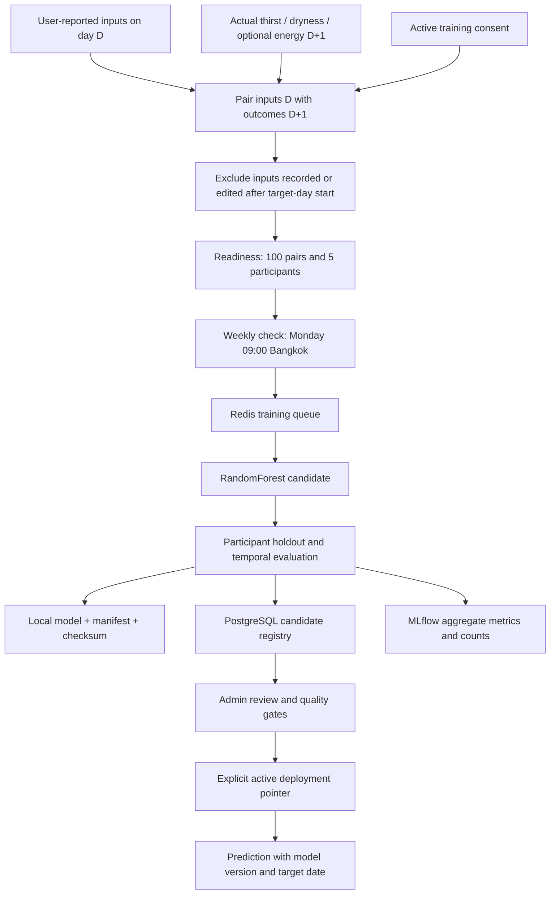

# Aphrodize — Component and Service Flows

สรุปจากโค้ดและ Compose ปัจจุบัน ณ **6 ตุลาคม 2026** สำหรับอธิบายระบบและใช้ประกอบรายงานโครงการ ไม่ใช่การรับรองว่าทุก integration พร้อมใช้งานจริง

ดูภาพรวมแบบเต็มใน [Full Input → Retraining → Output Flow](diagrams/full-input-retraining-output-flow.md)

## 1. ภาพรวมระบบ

ระบบแยก **หน้าจอ**, **API**, **งานเบื้องหลัง**, **ข้อมูลถาวร** และ **การทดลองโมเดล** ออกจากกัน เพื่อให้ผู้ใช้ไม่ต้องรอ HTTP request ยาวระหว่างวิเคราะห์ภาพ และให้การฝึกโมเดลไม่เปลี่ยนรุ่นที่ใช้งานโดยอัตโนมัติ

**ข้อควรอ่านใน diagram:** ลูกศรเป็นเส้นทางที่โค้ดรองรับ ไม่ใช่หลักฐานว่า integration นั้นผ่านการทดสอบครบแล้ว ส่วน Label Studio → training ยังไม่มี bridge อัตโนมัติ และ Daily Health ไม่ส่ง model artifact หรือข้อมูลรายบุคคลไป MLflow

## 2. บทบาทแต่ละ component

| Component | หน้าที่และข้อมูลที่รับ/ส่ง | จุดเข้าถึง / ข้อจำกัด |
| --- | --- | --- |
| Browser / React UI | รับภาพและข้อมูลสุขภาพ แสดงสถานะ ผลวิเคราะห์ กราฟ ประวัติ และแผนที่ UV | `localhost:3000`; frontend รันแยกจาก Compose นี้ |
| Next.js server routes | เป็นตัวกลางระหว่าง browser กับ backend อ่าน session cookie และแนบ authentication ที่เหมาะสม | `/api/*`; service credentials อยู่ฝั่ง server ไม่ใช่ browser |
| FastAPI | ตรวจรูปแบบข้อมูล สิทธิ์เจ้าของบัญชี consent และเงื่อนไขฟีเจอร์; บันทึก DB และส่งงานหนักเข้าคิว | `localhost:8000`; endpoints หลักอยู่ใต้ `/api/v1` |
| PostgreSQL | เก็บบัญชี session consent profile บันทึกรายวัน actual outcomes ผลวิเคราะห์ JSON และข้อมูล run/model/deployment audit | service `postgres:5432`; Compose ไม่ publish port นี้สู่ host |
| Redis + ARQ | คิว `inference` และ `training`, job state, heartbeat และ delayed cleanup | service `redis:6379`; ต้องมี password; ไม่ใช่แหล่งเก็บประวัติสุขภาพหลัก |
| MinIO | เก็บไฟล์ต้นฉบับชั่วคราว ภาพผลลัพธ์ ภาพสำหรับ review และ artifacts ของ experiments | API `localhost:9000`, console `localhost:9001`; image access ของผู้ใช้ผ่าน API ที่ตรวจสิทธิ์ |
| Inference worker | โหลด FFHQ-Wrinkle service, ดึงภาพจาก MinIO, วิเคราะห์และบันทึกผล; จัดการ annotation และ cleanup | ARQ queue `inference`; `max_jobs=1` |
| Trainer worker | ฝึก candidate จากข้อมูลที่ผ่านเงื่อนไข บันทึก metrics และตรวจ readiness ของ Daily Health ตาม schedule | ARQ queue `training`; ต้อง rebuild เมื่อโค้ดที่ bake ใน image เปลี่ยน |
| MLflow | เก็บ parameters, metrics, tags และ run lineage; image/UV experiments มี artifact tracking | `localhost:5000`; ไม่ใช่ระบบอนุมัติหรือ deploy โมเดลโดยอัตโนมัติ |
| Label Studio + SDK | สร้าง task ให้มนุษย์ review ภาพภายใต้ consent แยก; SDK ติดต่อ project ผ่าน URL/token | `localhost:8080`; ข้อมูลของ Label Studio อยู่ใน volume ของตัวเอง ไม่ได้ชี้ไป PostgreSQL แอปใน Compose นี้ |
| UV refresh / training | สร้าง snapshot พยากรณ์และ candidate จากข้อมูล UV; ใช้ local model/artifact directories | profiles `background` / `uv-training`; ไม่ผ่าน ARQ queue |
| Operator / reviewer | ตรวจคุณภาพ ความยินยอม provenance และ metrics ก่อนอนุมัติหรือ rollback | Daily Health ใช้ admin credentials แยกจาก service API; UV ใช้คำสั่ง operator |
| Monitoring routes / Docker logs | สรุป failure, latency, quality flags, UV freshness และสถานะ container/worker | เป็น observability ขั้นต้น ยังไม่มี Prometheus/Grafana/distributed tracing ใน Compose นี้ |

### แบ่งข้อมูลตามที่เก็บ

- **PostgreSQL:** structured records และ metadata ไม่ใช่ไฟล์ภาพจำนวนมาก
- **Redis:** งานและการประสาน worker ไม่ใช่ source of truth ของ actual outcomes
- **MinIO:** binary objects; buckets ได้แก่ `aphrodize-private`, annotation bucket และ `mlflow`
- **Local mounted directories:** Daily Health candidate models ใต้ `models/`; UV data/models/snapshots ใต้ `storage/`
- **MLflow:** experiment metadata อยู่ในฐานข้อมูล `mlflow` บน PostgreSQL; artifact root เป็น `s3://mlflow` และ client ใช้ MinIO endpoint สำหรับ upload

## 3. Flow: สมัครสมาชิกและเข้าสู่ระบบ

Browser ใช้ session cookie สำหรับคำขอถัดไป จากนั้น Next.js ส่ง bearer token ให้ backend ตรวจเจ้าของข้อมูล ไม่ส่ง service/admin secrets ไปยัง client ส่วน profile, consent และประวัติข้อมูลเชื่อมกับบัญชีใน PostgreSQL

## 4. Flow: อัปโหลดภาพ → วิเคราะห์ริ้วรอย → แสดงผล

1. ผู้ใช้เตรียมภาพและให้ consent สำหรับ image analysis
2. Next.js ส่งคำขอไป FastAPI; backend ตรวจเจ้าของบัญชี consent ชนิดไฟล์ ขนาด และ preflight
3. Backend เก็บภาพต้นฉบับใน MinIO และสร้าง `Analysis` ใน PostgreSQL; ภาพที่ผ่าน preflight ถูกตั้งเป็น `queued`
4. ส่ง `run_inference(analysis_id)` เข้า Redis queue `inference` โดยไม่ใส่ภาพทั้งไฟล์ใน job payload
5. Inference worker โหลด metadata จาก DB เปลี่ยนสถานะเป็น `running` และดึงภาพจาก MinIO
6. Wrinkle pipeline ทำ quality/face checks, alignment, segmentation และ ROI measurements ตามผล landmarks; สร้าง display artifacts รวม overlay, mask, regions และ outline เมื่อมีผลรองรับ
7. Worker เก็บ result JSON และ model lineage ใน PostgreSQL และเก็บ display artifacts ใน MinIO
8. UI poll ผลผ่าน API; artifact request ต้องผ่านการตรวจเจ้าของบัญชีและวันหมดอายุ

### Retention และความหมายของผล

- Original ถูกพยายามลบใน `finally` ไม่ว่าผลสำเร็จหรือผิดพลาด; ถ้าลบไม่สำเร็จมี error log ต้องติดตาม
- Display artifacts มีอายุ **24 ชั่วโมง**; API ปฏิเสธภาพที่หมดอายุแม้ delayed deletion ยังไม่ทำงาน
- Result JSON ยังอยู่ใน DB; อายุภาพไม่ได้หมายถึงการลบทุก record
- `completed` หมายถึง inference จบ ไม่ได้หมายถึงผลผ่าน human review; confidence abstention อาจเป็น completed ได้
- Marked-area percentage เป็นสัดส่วนพื้นที่ที่โมเดลระบุ ไม่ใช่ skin grade หรือการวินิจฉัย

## 5. Flow: Human review ผ่าน Label Studio

Analysis result ถูก commit **ก่อน**เริ่ม review จึงยังแสดงผลได้แม้ SDK/authentication ล้มเหลว Review ต้องมี consent `image-annotation-v1` แยกจาก analysis consent

โค้ดปัจจุบันส่งภาพ aligned face เป็น base64 inline ใน remote task ไม่ใช่ให้ Label Studio อ่าน private bucket โดยตรง จึงมีสำเนาใน Label Studio ที่ต้องลบร่วมด้วย ภาพ review/task มี retention **30 วัน** และมี delayed deletion, revoke handling และ reconciliation ตอน worker startup/ทุกต้นชั่วโมง

**ยังไม่ครบวงจร:** ไม่มีขั้นรับ annotation กลับมา ตรวจรับคุณภาพ และสร้าง dataset version ที่เชื่อมสู่ trainer อัตโนมัติ การมี task ไม่ได้อนุญาตนำข้อมูลผู้ใช้ไปฝึก และ image trainer ปัจจุบันรับเฉพาะ dataset แบบ `external_licensed` ที่อนุมัติแล้ว

## 6. Flow: Daily Health, actual data และ forecast

### 6.1 บันทึกและพยากรณ์เฉพาะบัญชี

UI → Next.js → FastAPI → PostgreSQL สำหรับ daily entries และ self-reported outcomes โดย actual กับ prediction เก็บแยกกัน

Personal forecast สำหรับ **เวลานอน/น้ำดื่ม** ใช้ linear trend (ordinary least squares) จากข้อมูล `user_reported` ของบัญชีนั้นเท่านั้น ภายใน **7 วันปฏิทิน**, ขั้นต่ำ **3 observations ต่อ metric**, พยากรณ์ **วันถัดไป** วันไม่มีข้อมูลคงเป็น `null` ไม่แทนด้วยศูนย์ และตัด fixture/import/synthetic/other-account/future rows ออก

Flow นี้คำนวณจากประวัติขณะเรียก API ไม่ใช่การเรียก ARQ retraining และไม่ได้สร้าง MLflow run ทุกครั้งที่เปิดกราฟ

### 6.2 ฝึก next-day outcome candidate

นี่เป็นอีก pipeline หนึ่ง: โมเดลเรียนรู้จากหลายบัญชีที่ consent ให้ฝึก ไม่ใช่การ fit โมเดลส่วนตัวแยกให้ทุกบัญชี

- Readiness ขั้นต่ำ 100 complete examples จาก 5 opted-in participants และโดยทั่วไป 25 examples ใหม่เทียบ candidate ล่าสุด; eligible snapshot ที่เปลี่ยนหลัง consent withdrawal มีเงื่อนไขพิเศษ
- Saving outcome ไม่เริ่ม training ทันที; trainer ตรวจทุกวันจันทร์ 02:00 UTC / 09:00 Bangkok และไม่ตรวจทันทีตอน startup
- Ground truth มาจาก self-reported thirst/dryness; energy รวมเมื่อ cohort ที่มีครบผ่านเกณฑ์ ไม่สร้าง labels จากสูตรหรือค่าพยากรณ์
- Imported/fixture/synthetic observations ไม่ใช่ ground truth ของ user training
- Candidate ต้องชนะ train-only mean baseline ตามเกณฑ์ทั้ง participant holdout และ temporal holdout สำหรับแต่ละ target ก่อน promote
- MLflow experiment `daily-health-next-day` เก็บเฉพาะ aggregate metrics/counts และ registry เก็บ `mlflow_run_id`; ไม่ upload health rows, participant IDs หรือ health model artifact
- Admin อนุมัติ/rollback แบบ explicit และมี actor/reason audit; MLflow run สำเร็จไม่ได้แปลว่า deployment สำเร็จ
- หากยังไม่มี approved candidate ระบบมี baseline เส้นทางเดิม ต้องแยกที่มาจาก next-day self-report model ไม่อ้างว่า baseline เป็นผล actual

## 7. Flow: Image training และ generic training

Approved dataset manifest → training API → `TrainingRun` ใน PostgreSQL → Redis `training` → trainer → MLflow metrics/checkpoint → `awaiting_approval`

Image trainer ตรวจ `approved://<id>@<manifest_sha256>` ภายใต้ approved data root และ dataset source `external_licensed` แล้วฝึก UNet candidate บันทึก checkpoint artifact ผ่าน MLflow ไป MinIO การเปลี่ยน checkpoint ที่ inference ใช้ต้องมีขั้น release/approved manifest ที่ตรง lineage; ไม่มี auto-deploy จาก MLflow

**Generic `time_series` / `tabular` training เป็น metadata-only:** log parameters/tags และคงสถานะ `awaiting_model_package`; API ระบุ `execution_kind=metadata_only` ไม่ใช่โมเดลที่ fit แล้ว ส่วน generic model-URI inference fail closed ด้วย `model_not_deployed` จนมี deployment support ไม่ควรสับสนกับ wrinkle inference หรือ Daily Health pipeline ที่ทำงานเฉพาะทาง

## 8. Flow: UV ecosystem

Public UV data → local raw data → SARIMAX candidate/evaluation → quality gate + MLflow run → operator promotion → local active model bundle → UV refresh → forecast snapshot → FastAPI → Next.js → UV map

- UV ใช้ local directories `storage/data/uv`, `storage/models/uv`, `storage/artifacts/uv` ไม่ใช่ PostgreSQL เป็นแหล่ง snapshot และไม่ผ่าน Redis
- `uv-refresh` รัน refresh เมื่อเปิด service จากนั้นทุก **6 ชั่วโมง** หากสำเร็จ หรือ retry **30 นาที** หากล้มเหลว
- `uv-training` เริ่ม pipeline ทันทีเมื่อเปิด service จากนั้นเว้น **30 วัน** หากสำเร็จ หรือ **1 วัน** หากล้มเหลว ไม่ใช่ cron ที่เริ่มตามวันปฏิทิน
- Compose default tracking URI คือ `http://mlflow:5000`; standalone script default `http://localhost:5000`; override ได้ด้วย environment
- Candidate ไม่ promote อัตโนมัติ; operator ใช้คำสั่ง promote/rollback และบันทึก audit
- API ตรวจ snapshot/freshness; snapshot ไม่พร้อมต้องแสดง unavailable ไม่เติม forecast ปลอม

## 9. Monitoring และ failure boundaries

| สิ่งที่ตรวจ | เครื่องมือ / หลักฐาน | ข้อจำกัด |
| --- | --- | --- |
| Container / API availability | Docker healthchecks; `/api/v1/health` | Healthy ไม่รับรองว่าทุก endpoint, token หรือ model artifact ใช้ได้ |
| Worker availability | Redis ARQ heartbeat และ queue state | Queue ว่างอาจหมายถึงไม่มีงาน ไม่ใช่หลักฐานว่า inference ผ่าน |
| Image outcomes | `/api/v1/monitoring/analyses`: counts, failures, quality flags, p95 | p95 จาก created → completed รวมเวลารอคิว; ไม่ใช่เวลา GPU/CPU อย่างเดียว |
| UV operation | `/api/v1/monitoring/uv`: freshness/quality/pipeline status | Snapshot หาย/ไม่ valid ตอบ 503 |
| Training experiments | MLflow parameters/metrics/tags/artifact links | Smoke/metadata-only runs ไม่พิสูจน์ความแม่นยำโมเดลจริง |
| Deployment decisions | PostgreSQL Daily Health events; UV lifecycle audit | ต้องมี reviewer และเหตุผล ไม่อาศัย run status อย่างเดียว |

## 10. Deployment readiness (source review: 6 October 2026)

This document describes code-supported flows, not live container health. Before using a deployment, verify:

1. Label Studio API key, project and task permissions; a healthy container does not prove SDK authentication.
2. Separate admin credentials for Daily Health model review; missing/invalid configuration fails closed.
3. Image worker, checksum-pinned model files and private storage; annotation tasks do not imply an accepted training dataset.
4. UV refresh/training profiles and valid fresh snapshots; a missing snapshot remains unavailable.
5. Generic metadata-only training and model_not_deployed inference boundaries.
6. Logs and aggregate monitoring; centralized alerts/distributed tracing are not included.

## 11. Source map สำหรับตรวจรายละเอียด

| ส่วน | โค้ด / เอกสาร |
| --- | --- |
| Services, networks, volumes, profiles | [compose.yml](../../compose.yml) |
| Frontend session proxy | [auth login route](../../frontend/src/app/api/auth/login/route.ts), [analysis route](../../frontend/src/app/api/analysis/route.ts) |
| Upload/result/artifact access | [analysis service](../../backend/services/analysis_service.py), [analysis routes](../../backend/api/v1/routes/analyses.py) |
| Inference and cleanup | [inference worker](../../backend/workers/inference_worker.py) |
| Annotation consent and remote tasks | [annotation service](../../backend/services/annotation_service.py), [Label Studio client](../../backend/libs/labelstudio_client.py) |
| Training worker and schedule | [trainer worker](../../backend/workers/trainer_worker.py), [curated training](../../backend/services/curated_training.py) |
| Account-only forecast | [personal forecast](../../backend/services/daily_health_personal_forecast.py) |
| Outcome training / release / tracking | [training](../../backend/services/daily_health_training.py), [registry](../../backend/services/daily_health_model_registry.py), [tracking](../../backend/services/daily_health_tracking.py) |
| Human-review boundaries | [Human Review](../ai/Human-Review.md) |
| UV lifecycle | [uv_mlops.py](../../scripts/uv_mlops.py), [UV lifecycle](../../backend/services/uv_lifecycle.py), [refresh script](../../scripts/refresh_uv_forecast.py) |
| Monitoring and MLflow storage | [monitoring routes](../../backend/api/v1/routes/monitoring.py), [MLflow startup](../../docker/mlflow-start.sh) |

**ข้อควรระวัง:** เก็บ credentials ใน local environment ตาม service ที่ใช้ ไม่ใส่ secrets, private images หรือ health records ในเอกสาร/Git และไม่ใช้ `docker compose down -v` หากต้องการรักษาข้อมูลเดิม
