# ER Diagram — ORM ปัจจุบัน (ครบทุกตาราง)

อ้างอิง [`backend/core/db/models.py`](../../../backend/core/db/models.py) ณ 28 กันยายน 2026 แสดงทุกตารางและทุกคอลัมน์ใน SQLAlchemy model; เส้นแสดง foreign key จริง

```mermaid
erDiagram
    USERS ||--o| ACCOUNTS : user_id
    ACCOUNTS ||--o{ ACCOUNT_ROLES : account_id
    ACCOUNTS o|--o{ ACCOUNT_ROLES : granted_by_account_id
    ACCOUNTS ||--o{ AUTH_SESSIONS : account_id
    ACCOUNTS ||--o{ AUTH_TOKENS : account_id
    ACCOUNTS o|--o{ LOGIN_AUDIT : account_id
    USERS ||--o{ CONSENTS : user_id
    USERS ||--o| USER_PROFILES : user_id
    USERS ||--o{ DAILY_HEALTH_ENTRIES : user_id
    USERS ||--o{ DAILY_HEALTH_OUTCOMES : user_id
    USERS ||--o| DAILY_HEALTH_PROFILES : user_id
    USERS ||--o| DAILY_HEALTH_AGE_BANDS : user_id
    USERS ||--o{ DAILY_HEALTH_MENSTRUAL_CHECKINS : user_id
    DAILY_HEALTH_MODEL_VERSIONS o|--o{ DAILY_HEALTH_MODEL_DEPLOYMENTS : active_version_id
    DAILY_HEALTH_MODEL_VERSIONS o|--o{ DAILY_HEALTH_MODEL_DEPLOYMENTS : previous_version_id
    USERS ||--o{ ANALYSES : user_id
    ANALYSES ||--o| ANNOTATION_TASKS : analysis_id_user_id
    USERS ||--o{ ANNOTATION_TASKS : user_id

    USERS {
        uuid id PK
        string status
        datetime created_at
        datetime deleted_at
    }

    ACCOUNTS {
        uuid id PK
        uuid user_id FK, UK
        string display_name
        string email UK
        string password_hash
        datetime email_verified_at
        datetime password_updated_at
        datetime last_login_at
        int failed_login_count
        datetime locked_until
        datetime created_at
        datetime updated_at
    }

    ACCOUNT_ROLES {
        uuid id PK
        uuid account_id FK
        string role
        datetime granted_at
        uuid granted_by_account_id FK
    }

    AUTH_SESSIONS {
        uuid id PK
        uuid account_id FK
        string refresh_token_hash UK
        string user_agent
        string ip_hash
        datetime created_at
        datetime last_seen_at
        datetime expires_at
        datetime revoked_at
        string revoked_reason
    }

    AUTH_TOKENS {
        uuid id PK
        uuid account_id FK
        string purpose
        string token_hash UK
        datetime created_at
        datetime expires_at
        datetime consumed_at
    }

    LOGIN_AUDIT {
        uuid id PK
        uuid account_id FK
        string email_hash
        string outcome
        string ip_hash
        string user_agent
        datetime created_at
    }

    CONSENTS {
        uuid id PK
        uuid user_id FK
        string version
        datetime accepted_at
        datetime revoked_at
    }

    USER_PROFILES {
        uuid user_id PK, FK
        string sex
        string age_group
        string skin_type
        string wellness_goal
        string sunscreen_frequency
        string menstrual_tracking
        datetime updated_at
    }

    DAILY_HEALTH_ENTRIES {
        uuid id PK
        uuid user_id FK
        date local_date
        string timezone
        int sleep_duration_minutes
        int water_intake_ml
        int outdoor_exposure_choice
        float sleep_score_0_100
        string sleep_score_method
        float predicted_thirst_score_0_10
        float predicted_dryness_score_0_10
        date prediction_target_date
        string prediction_status
        string prediction_model_id
        string data_source
        datetime created_at
        datetime updated_at
    }

    DAILY_HEALTH_OUTCOMES {
        uuid id PK
        uuid user_id FK
        date target_date
        float reported_energy_level_0_10
        float reported_thirst_level_0_10
        float reported_dryness_level_0_10
        datetime created_at
        datetime updated_at
    }

    DAILY_HEALTH_PROFILES {
        uuid user_id PK, FK
        string smoking_status
        datetime updated_at
    }

    DAILY_HEALTH_AGE_BANDS {
        uuid user_id PK, FK
        string age_band
        datetime updated_at
    }

    DAILY_HEALTH_MENSTRUAL_CHECKINS {
        uuid id PK
        uuid user_id FK
        date local_date
        boolean currently_menstruating
        datetime created_at
    }

    DAILY_HEALTH_DATASET_RECORDS {
        uuid id PK
        string dataset_fingerprint
        string source_dataset_name
        int source_row_number
        string participant_key
        date local_date
        string data_source
        string generation_rule_version
        boolean training_eligible
        string training_exclusion_reason
        json record_payload
        datetime imported_at
    }

    DAILY_HEALTH_MODEL_VERSIONS {
        string version_id PK
        string model_family
        string status
        string dataset_fingerprint UK
        int training_records
        int participant_count
        string artifact_uri
        json metrics
        datetime created_at
        datetime completed_at
    }

    DAILY_HEALTH_MODEL_DEPLOYMENTS {
        string deployment_key PK
        string active_version_id FK
        string previous_version_id FK
        string approval_reason
        datetime updated_at
    }

    DAILY_HEALTH_MODEL_DEPLOYMENT_EVENTS {
        uuid id PK
        string action
        string version_id
        string reason
        datetime created_at
    }

    ANALYSES {
        uuid id PK
        uuid user_id FK
        string status
        string object_key UK
        string content_type
        float image_quality_score
        json quality_flags
        string model_family
        string model_version
        json result
        string error_category
        datetime created_at
        datetime completed_at
    }

    ANNOTATION_TASKS {
        uuid id PK
        uuid analysis_id FK, UK
        uuid user_id FK
        string object_key UK
        int label_studio_task_id
        datetime expires_at
    }

    TRAINING_RUNS {
        uuid id PK
        string model_family
        string dataset_uri
        string status
        string mlflow_run_id
        json config
        datetime created_at
    }

    INFERENCE_RUNS {
        uuid id PK
        string model_family
        string model_uri
        json input_data
        string status
        json result
        string error_category
        datetime created_at
        datetime completed_at
    }

    PRODUCTS {
        uuid id PK
        string brand
        string name
        string variant
        string category
        int price_satang
        datetime price_checked_at
        string ingredients_label
        json ingredients_inci
        string warnings_label
        json target_skin_types
        json concerns
        string source_url
        string status
        datetime reviewed_at
        datetime created_at
        datetime updated_at
    }

```

`PK` = primary key, `FK` = foreign key, `UK` = unique key ของคอลัมน์เดียว; unique แบบหลายคอลัมน์และ partial index ไม่แสดงกำกับในช่องคอลัมน์

- ผลจริงอยู่ใน `daily_health_outcomes`; `daily_health_entries` เก็บข้อมูลที่รายงานและผลทำนาย
- `consents` มี partial unique index ที่ `(user_id, version)` เมื่อ `revoked_at IS NULL`
- `annotation_tasks` มี composite foreign key `(analysis_id, user_id)` ไปที่ `analyses` เพื่อบังคับเจ้าของคนเดียวกัน
- `daily_health_entries`, `daily_health_outcomes` และ `daily_health_menstrual_checkins` มี unique `(user_id, วันที่)`
- `daily_health_model_deployment_events.version_id` เป็นข้อความ ไม่มี foreign key ไปยัง model version; ตาราง dataset, training/inference runs และ products ไม่มี foreign key
- ภาพอยู่ใน MinIO; `object_key` ใน PostgreSQL เป็นเพียงตัวอ้างอิง

## ความต่างกับ PostgreSQL ที่รันอยู่

ตาราง `products` ในฐานข้อมูลจริงยังเป็น schema รุ่นเก่า: ขาด 12 คอลัมน์ที่ ORM กำหนด (`variant`, `price_satang`, `price_checked_at`, `ingredients_label`, `ingredients_inci`, `warnings_label`, `target_skin_types`, `concerns`, `source_url`, `status`, `reviewed_at`, `updated_at`) และยังมีคอลัมน์เก่า (`ingredients_text`, `is_active`, `price_thb`, `product_url`) ดังนั้นแผนภาพนี้เป็น **schema ที่โค้ดคาดหวัง** ยังไม่ใช่ schema จริงที่ตรงกันทุกตาราง และยังไม่ควรเรียกว่า final
