# Database ER - current ORM

Checked against [models.py](../../../backend/core/db/models.py) on 6 October 2026. All 24 ORM tables and mapped columns are included. Relationships below come from declared column ForeignKey entries; extra constraints added by startup SQL must also be checked in [session.py](../../../backend/core/db/session.py).

```mermaid
erDiagram
    USERS ||--o| ACCOUNTS : user_id
    ACCOUNTS ||--o{ ACCOUNT_ROLES : account_id
    ACCOUNTS o|--o{ ACCOUNT_ROLES : granted_by_account_id
    ACCOUNTS ||--o{ AUTH_SESSIONS : account_id
    ACCOUNTS ||--o{ AUTH_TOKENS : account_id
    ACCOUNTS o|--o{ LOGIN_AUDIT : account_id
    USERS ||--o{ CONSENTS : user_id
    USERS ||--o| USER_PROFILES : user_id
    USERS ||--o{ QUESTIONNAIRES : user_id
    USERS ||--o{ DAILY_HEALTH_ENTRIES : user_id
    USERS ||--o| DAILY_HEALTH_PROFILES : user_id
    USERS ||--o| DAILY_HEALTH_AGE_BANDS : user_id
    USERS ||--o{ DAILY_HEALTH_MENSTRUAL_CHECKINS : user_id
    USERS ||--o{ ACNE_OBSERVATIONS : user_id
    USERS ||--o{ DAILY_HEALTH_OUTCOMES : user_id
    DAILY_HEALTH_MODEL_VERSIONS o|--o{ DAILY_HEALTH_MODEL_DEPLOYMENTS : active_version_id
    DAILY_HEALTH_MODEL_VERSIONS o|--o{ DAILY_HEALTH_MODEL_DEPLOYMENTS : previous_version_id
    USERS ||--o{ ANALYSES : user_id
    USERS ||--o{ ANNOTATION_TASKS : user_id
    USERS {
        uuid id PK
        string status
        datetime created_at
        datetime deleted_at "nullable"
    }
    ACCOUNTS {
        uuid id PK
        uuid user_id FK, UK
        string display_name
        string email UK
        string password_hash
        datetime email_verified_at "nullable"
        datetime password_updated_at "nullable"
        datetime last_login_at "nullable"
        int failed_login_count
        datetime locked_until "nullable"
        datetime created_at
        datetime updated_at
    }
    ACCOUNT_ROLES {
        uuid id PK
        uuid account_id FK
        string role
        datetime granted_at
        uuid granted_by_account_id FK "nullable"
    }
    AUTH_SESSIONS {
        uuid id PK
        uuid account_id FK
        string refresh_token_hash UK
        string user_agent "nullable"
        string ip_hash "nullable"
        datetime created_at
        datetime last_seen_at "nullable"
        datetime expires_at
        datetime revoked_at "nullable"
        string revoked_reason "nullable"
    }
    AUTH_TOKENS {
        uuid id PK
        uuid account_id FK
        string purpose
        string token_hash UK
        datetime created_at
        datetime expires_at
        datetime consumed_at "nullable"
    }
    LOGIN_AUDIT {
        uuid id PK
        uuid account_id FK "nullable"
        string email_hash
        string outcome
        string ip_hash "nullable"
        string user_agent "nullable"
        datetime created_at
    }
    CONSENTS {
        uuid id PK
        uuid user_id FK
        string version
        datetime accepted_at
        datetime revoked_at "nullable"
    }
    USER_PROFILES {
        uuid user_id PK, FK
        string sex
        string age_group
        string skin_type
        string wellness_goal
        string sunscreen_frequency
        string menstrual_tracking
        datetime updated_at
    }
    QUESTIONNAIRES {
        uuid id PK
        uuid user_id FK
        json answers
        datetime created_at
    }
    PRODUCTS {
        uuid id PK
        string brand
        string name
        string variant
        string market "nullable"
        string price_source_url "nullable"
        string purchase_url "nullable"
        string image_url "nullable"
        string application_regions
        string category
        int price_satang "nullable"
        datetime price_checked_at "nullable"
        string ingredients_label
        string ingredients_inci
        string warnings_label
        string target_skin_types
        string concerns
        string source_url "nullable"
        int spf "nullable"
        boolean broad_spectrum
        int water_resistant_minutes "nullable"
        string status
        datetime reviewed_at "nullable"
        datetime created_at
        datetime updated_at
    }
    DAILY_HEALTH_ENTRIES {
        uuid id PK
        uuid user_id FK
        date local_date
        string timezone
        int sleep_duration_minutes
        int water_intake_ml
        float weight_kg "nullable"
        float calculated_thirst_score_0_10 "nullable"
        string thirst_score_method "nullable"
        int outdoor_exposure_choice
        float sleep_score_0_100
        string sleep_score_method
        float predicted_thirst_score_0_10 "nullable"
        float predicted_dryness_score_0_10 "nullable"
        json next_day_forecasts "nullable"
        date prediction_target_date "nullable"
        string prediction_status
        string prediction_model_id "nullable"
        string data_source
        datetime created_at
        datetime updated_at
    }
    DAILY_HEALTH_DATASET_RECORDS {
        uuid id PK
        string dataset_fingerprint
        string source_dataset_name
        int source_row_number
        string participant_key "nullable"
        date local_date "nullable"
        string data_source
        string generation_rule_version "nullable"
        boolean training_eligible
        string training_exclusion_reason
        json record_payload
        datetime imported_at
    }
    DAILY_HEALTH_PROFILES {
        uuid user_id PK, FK
        string smoking_status "nullable"
        string skin_type "nullable"
        float weight_kg "nullable"
        float height_cm "nullable"
        datetime updated_at
    }
    DAILY_HEALTH_AGE_BANDS {
        uuid user_id PK, FK
        string age_band
        datetime updated_at
    }
    DAILY_HEALTH_MENSTRUAL_CHECKINS {
        uuid id PK
        uuid user_id FK
        date local_date
        boolean currently_menstruating
        datetime created_at
    }
    ACNE_OBSERVATIONS {
        uuid id PK
        uuid user_id FK
        date local_date
        string response
        json regions
        string provenance
        string consent_version
        datetime created_at
        datetime updated_at
    }
    DAILY_HEALTH_OUTCOMES {
        uuid id PK
        uuid user_id FK
        date target_date
        float reported_energy_level_0_10 "nullable"
        float reported_thirst_level_0_10 "nullable"
        float reported_dryness_level_0_10 "nullable"
        datetime created_at
        datetime updated_at
    }
    DAILY_HEALTH_MODEL_VERSIONS {
        string version_id PK
        string model_family
        string mlflow_run_id "nullable"
        string status
        string dataset_fingerprint UK
        int training_records
        int participant_count
        string artifact_uri "nullable"
        json metrics "nullable"
        datetime created_at
        datetime completed_at "nullable"
    }
    DAILY_HEALTH_MODEL_DEPLOYMENTS {
        string deployment_key PK
        string active_version_id FK "nullable"
        string previous_version_id FK "nullable"
        string approval_reason "nullable"
        datetime updated_at
    }
    DAILY_HEALTH_MODEL_DEPLOYMENT_EVENTS {
        uuid id PK
        string action
        string version_id "nullable"
        string reason
        string actor "nullable"
        datetime created_at
    }
    ANALYSES {
        uuid id PK
        uuid user_id FK
        string status
        string object_key UK
        string content_type
        float image_quality_score "nullable"
        json quality_flags
        string model_family
        string model_version
        json result "nullable"
        string error_category "nullable"
        datetime created_at
        datetime completed_at "nullable"
    }
    ANNOTATION_TASKS {
        uuid id PK
        uuid analysis_id UK
        uuid user_id FK
        string object_key UK
        int label_studio_task_id "nullable"
        datetime expires_at
    }
    TRAINING_RUNS {
        uuid id PK
        string model_family
        string dataset_uri
        string status
        string mlflow_run_id "nullable"
        json config
        datetime created_at
    }
    INFERENCE_RUNS {
        uuid id PK
        string model_family
        string model_uri
        json input_data
        string status
        json result "nullable"
        string error_category "nullable"
        datetime created_at
        datetime completed_at "nullable"
    }
```

## Schema boundaries

- Analysis results and display-artifact references are in `analyses.result`; there are no separate ORM `images`, `wrinkle_results`, `acne_results`, `factor_results`, `recommendations` or `observations` tables. Products use `products`; acne self-reports use `acne_observations`.
- `daily_health_entries.next_day_forecasts` stores verified forecasts separately from calculated hydration and `daily_health_outcomes` labels. Model versions include `mlflow_run_id`; deployment events include nullable authenticated `actor`.
- `annotation_tasks.analysis_id` is unique in the ORM but has no inline ForeignKey. Startup SQL handles additional analysis/owner integrity; do not invent an ORM relationship. Deployment-event `version_id` deliberately has no FK so audit records can survive pruning.
- Composite uniqueness, check constraints, indexes and upgrade SQL are defined in source, not fully represented by this diagram. Account/security tables being present does not imply all corresponding auth workflows are implemented; see [Auth and Account](../Auth-Account-Database-Design.md).
- This is a source schema snapshot, not confirmation that a running database has applied every startup upgrade.
