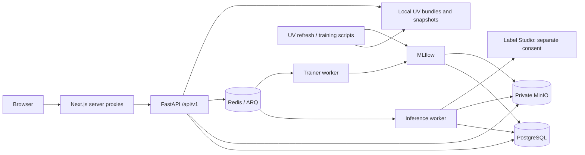

# สถาปัตยกรรมขณะรัน

ตรวจเทียบ Compose และ `backend/api/v1/router.py` วันที่ 6 ตุลาคม 2026 รายละเอียดอยู่ใน [เส้นทางองค์ประกอบระบบ](../Component-Flows.md)

Inference เป็น asynchronous ตั้งแต่รับภาพ เบราว์เซอร์อ่านสถานะและ artifacts ผ่าน proxy ที่ตรวจ session; API ตรวจเจ้าของด้วย Bearer token Inference/training ใช้คิว Redis แยกกัน ส่วน UV เป็น script/service ที่อ่านเขียนไฟล์ ไม่ผ่าน ARQ

| Compose | หน้าที่ |
| --- | --- |
| `compose.yml` | API/PostgreSQL/Redis; frontend local รันแยกด้วย pnpm |
| Profile `ai` | MinIO, initializer, inference/trainer, MLflow, Label Studio |
| Profile `background` | UV refresh ทุก 6 ชั่วโมง; retry 30 นาที |
| Profile `uv-training` | Candidate pipeline เมื่อเริ่ม service แล้วเว้น 30 วัน; ไม่ auto-promote |
| Profile `demo` | Fixture loader แบบเรียกเอง |
| `compose.vm.yml` | VM รวม frontend/reverse proxy; [คู่มือ VM](../../deploy-vm.md) |
| `compose.gpu.yml` | Worker แยกเครื่อง; [คู่มือ GPU](../../deploy-gpu.md) |
| `compose.release.yml` | Immutable registry image overlay; [CI/CD](../../cicd-vm.md) |

PostgreSQL เก็บ account/consent/health/job/results/registry; MinIO เก็บภาพและ MLflow artifacts; Daily Health candidates และ UV bundles ใช้ local model directories ตามโค้ด ไม่ถือว่าทุก artifact อยู่ใน MinIO

Image trainer รับเฉพาะ approved external licensed data ไม่มีการนำภาพผู้ใช้ไปฝึกอัตโนมัติ Generic training เป็น metadata-only และ generic inference ยังไม่ deploy โมเดล Container healthy ไม่ยืนยัน model/credentials/snapshot readiness

Schema จริง: [Database ER](database-er.md) ไฟล์ `.dio`/PNG ข้างเอกสารเป็นภาพออกแบบเดิม ใช้ Mermaid และโค้ดตรวจ runtime ปัจจุบัน
