# Aphrodize — Full Input → Retraining → Output Flow

อ้างอิงโค้ดและการตรวจระบบ ณ **6 ตุลาคม 2026** อ่านรายละเอียดแต่ละ component ได้ใน [Component and Service Flows](../Component-Flows.md)

- **เส้นทึบ:** workflow ที่มีในโค้ด ไม่ใช่การรับรองว่า integration พร้อมใช้งานจริงทุกจุด
- **เส้นประ:** ขั้นที่ยังไม่ implemented หรือขั้น release ที่ต้องดำเนินการโดย operator
- **Candidate ไม่ใช่ deployed model:** training สำเร็จไม่ได้เปลี่ยนโมเดลที่ให้บริการโดยอัตโนมัติ

```mermaid
flowchart TD
    USER["User"] --> UI["Next.js UI<br/>Image upload / Daily Health / UV map"]
    UI --> FE["Next.js server routes<br/>Session cookie and API proxy"]
    FE --> API["FastAPI<br/>Authentication / Ownership / Validation / Consent"]

    DB[("PostgreSQL<br/>Accounts / Consent / Inputs / Actual outcomes<br/>Results / Model registry / Audit events")]
    REDIS[("Redis + ARQ<br/>Job queues / Heartbeats / Delayed jobs")]
    MINIO[("MinIO<br/>Private images / Review copies / Experiment artifacts")]
    API <--> DB

    subgraph IMAGE["1. Face image analysis"]
        IMG["Uploaded image"] --> CHECK["Image consent and preflight checks"]
        CHECK -->|Pass| STORE["Store temporary original in MinIO<br/>Create queued Analysis in PostgreSQL"]
        CHECK -->|Reject| REJECT["Rejected result with reason"]
        STORE --> IQ["Redis queue: inference<br/>Payload: analysis ID"]
        IQ --> IW["Inference worker<br/>Load metadata and private image"]
        IW --> MODEL["FFHQ-Wrinkle pipeline<br/>Face checks / Alignment / Segmentation"]
        MODEL --> ROI["Landmark-based ROI measurements<br/>Marked-area percentage / Regional results"]
        ROI --> SAVE["Persist result JSON in PostgreSQL<br/>Save overlay / mask / regions / outline in MinIO"]
        MODEL -->|Quality rejection or error| FAIL["Persist rejected or failed result"]
        SAVE --> CLEAN["Delete original<br/>Schedule display artifact deletion after 24 hours"]
        FAIL --> ORIGINAL["Attempt original-image deletion"]
        SAVE --> POLL["UI polls owned analysis result<br/>Fetch unexpired artifacts through API"]
        REJECT --> POLL
        FAIL --> POLL
        POLL --> FACEOUT["Face analysis output<br/>Measurements / Region masks / Limitations"]
        SAVE --> RGATE["Recommendation eligibility checks<br/>Profile / Safety / Released image evidence"]
        RGATE --> REC["Rule-based guidance<br/>Reviewed product catalog"]
    end

    API --> IMG
    STORE --> MINIO
    STORE --> DB
    IQ --> REDIS
    IW --> MINIO
    SAVE --> DB
    SAVE --> MINIO
    CLEAN --> REDIS

    subgraph REVIEW["2. Optional human review"]
        AC{"Separate annotation consent<br/>and Label Studio configuration?"}
        AC -->|No| SKIP["Skip review without blocking user result"]
        AC -->|Yes| STAGE["Stage aligned review image<br/>Annotation bucket + PostgreSQL task"]
        STAGE --> PUB["Queue publish_annotation_task"]
        PUB --> SDK["Label Studio SDK<br/>Authenticated project request"]
        SDK --> LS["Label Studio task<br/>Inline review image"]
        LS --> HUMAN["Human reviews or draws annotation"]
        HUMAN -. "Not implemented" .-> ACCEPT["Accept annotations and check quality"]
        ACCEPT -. "Not implemented" .-> DATASET["Versioned user-annotation dataset<br/>Requires training-use policy and consent"]
        LS --> RET["30-day retention / Consent revocation<br/>Delete remote task and review copy"]
    end

    SAVE --> AC
    STAGE --> MINIO
    STAGE --> DB
    PUB --> REDIS

    subgraph ITRAIN["3. Approved image model training"]
        EXT["Approved licensed external dataset"] --> MANIFEST["Validate approved manifest<br/>Dataset hash and provenance"]
        MANIFEST --> TREQ["Training API<br/>Persist TrainingRun"]
        TREQ --> TQ["Redis queue: training"]
        TQ --> ITW["Trainer worker<br/>Train UNet candidate"]
        ITW --> IMET["Evaluate candidate<br/>Log loss / Metrics / Checkpoint"]
        IMET --> IREG["TrainingRun: awaiting_approval"]
        IREG --> IREVIEW["Operator reviews model and release evidence"]
        IREVIEW -. "Explicit release step" .-> RELEASE["Approved checkpoint manifest<br/>Confidence / Release policy"]
        RELEASE -. "Configure and reload serving" .-> MODEL
    end

    TREQ --> DB
    TQ --> REDIS

    subgraph DAILY["4. Daily Health inputs and forecasts"]
        ENTRY["Daily inputs<br/>Sleep / Water / Outdoor exposure"] --> DSTORE["Store account-linked daily entries"]
        ACTUAL["Actual self-reported outcomes<br/>Thirst / Dryness / Optional energy"] --> OSTORE["Store outcomes separately from predictions"]

        DSTORE --> PERSONAL["Account-only personal forecast<br/>7-day actual history / Minimum 3 observations<br/>Linear trend for sleep and water"]
        PERSONAL --> POUT["Actual history + Next-day prediction<br/>Missing days remain null"]

        DSTORE --> SIGNAL["Daily Health prediction service<br/>Use active approved candidate when available"]
        SIGNAL --> SOUT["Health signals with source<br/>Target date / Model version / Limitations"]
        SOUT --> RECEIPT["Retain prediction separately<br/>Never use prediction as actual label"]

        DSTORE --> PAIR["Pair inputs on day D<br/>with actual outcomes on D+1"]
        OSTORE --> PAIR
        PAIR --> CONSENT["Filter active training consent<br/>User-reported data only"]
        CONSENT --> LEAK["Leakage checks<br/>Exclude inputs recorded or edited too late"]
        LEAK --> READY{"Training readiness<br/>100 complete pairs / 5 participants<br/>New-data or eligible-snapshot checks"}
        READY -->|Not ready| WAIT["Wait for more eligible observations"]
        READY -->|Ready| WEEK["Weekly readiness check<br/>Monday 09:00 Asia/Bangkok"]
        WEEK --> DQ["Redis queue: training"]
        DQ --> RF["Trainer worker<br/>RandomForest candidate"]
        RF --> EVAL["Participant holdout + Temporal evaluation<br/>Compare each target against mean baseline"]
        EVAL --> LOCAL["Local model + Manifest + Checksum"]
        EVAL --> DREG["PostgreSQL candidate registry"]
        EVAL --> TRACK["MLflow aggregate metrics and counts<br/>No personal rows or health-model artifact"]
        DREG --> ADMIN["Authenticated admin review<br/>Quality gates + Written reason"]
        ADMIN -->|Approved| DEPLOY["Update active deployment pointer<br/>Record actor / Reason / Version"]
        ADMIN -->|Rejected| KEEP["Keep candidate inactive"]
        DEPLOY --> SIGNAL
        DEPLOY --> ROLLBACK["Explicit rollback to previous version"]
        ROLLBACK --> SIGNAL
    end

    API --> ENTRY
    API --> ACTUAL
    DSTORE --> DB
    OSTORE --> DB
    RECEIPT --> DB
    DQ --> REDIS
    DREG --> DB
    DEPLOY --> DB

    subgraph UVFLOW["5. UV training and forecast delivery"]
        PUBLIC["Public UV data"] --> RAW["Local raw data"]
        RAW --> UVTRAIN["UV training pipeline<br/>SARIMAX candidate"]
        UVTRAIN --> UVTEST["Evaluation and quality gates"]
        UVTEST --> UVREVIEW["Explicit operator promotion / Rollback"]
        UVREVIEW --> UVMODEL["Local active model bundle"]
        UVMODEL --> REFRESH["UV refresh service<br/>Build forecast snapshot"]
        REFRESH --> SNAP["Local versioned UV snapshots"]
        SNAP --> UVAPI["FastAPI UV endpoints<br/>Validate snapshot and freshness"]
        UVAPI --> UVOUT["UV map and selected-area forecast"]
    end

    API --> UVAPI

    subgraph TRACKING["6. Experiment tracking and observability"]
        MLFLOW["MLflow tracking server"]
        MLDB[("PostgreSQL<br/>Separate mlflow database")]
        MLART[("MinIO mlflow bucket<br/>Image / UV experiment artifacts")]
        MLFLOW --> MLDB
        OBS["Docker healthchecks / Worker heartbeats<br/>API monitoring / Logs / Model audit"]
        ALERT["Operator investigation<br/>Retry / Correct configuration / Restore service"]
        OBS --> ALERT
    end

    IMET --> MLFLOW
    IMET --> MLART
    TRACK --> MLFLOW
    UVTEST --> MLFLOW
    UVTEST --> MLART
    API --> OBS
    IW --> OBS
    ITW --> OBS
    RF --> OBS
    REFRESH --> OBS

    FACEOUT --> OUTPUT["User-visible output"]
    REC --> OUTPUT
    POUT --> OUTPUT
    SOUT --> OUTPUT
    UVOUT --> OUTPUT
    OUTPUT --> UI

    classDef storage fill:#f3e8ff,stroke:#8b5cf6,color:#282033;
    classDef output fill:#ffe4e8,stroke:#ef5c70,color:#38252b;
    classDef human fill:#fff3d6,stroke:#c9952d,color:#40311b;
    classDef missing fill:#f4f4f5,stroke:#888,stroke-dasharray:5 5,color:#444;
    class DB,REDIS,MINIO,MLDB,MLART,LOCAL,SNAP storage;
    class FACEOUT,REC,POUT,SOUT,UVOUT,OUTPUT output;
    class HUMAN,IREVIEW,ADMIN,UVREVIEW human;
    class ACCEPT,DATASET missing;
```

## ข้อควรเข้าใจ

1. **MLflow ไม่ deploy โมเดลเอง:** การฝึกสำเร็จสร้าง candidate ต้องตรวจและอนุมัติก่อนเปลี่ยนรุ่นที่ให้บริการ
2. **Actual outcomes ไม่ใช่ predictions:** retraining ใช้ผลที่ผู้ใช้รายงานจริง ไม่ใช้คะแนนพยากรณ์ย้อนกลับเป็น label
3. **Personal forecast กับ retraining คนละ flow:** sleep/water ใช้ประวัติบัญชีเดียวและคำนวณเมื่อเรียก API ส่วน RandomForest outcome model ฝึกจากหลายบัญชีที่ consent และไม่สร้าง MLflow run ทุกครั้งที่เปิดกราฟ
4. **Weekly check มาก่อน readiness decision ใน execution จริง:** diagram แสดงเงื่อนไขข้อมูลก่อนคิวฝึกเพื่ออ่านง่าย; trainer ตรวจ readiness ตาม schedule แล้วจึง enqueue หากผ่าน ไม่ใช่ readiness เริ่ม scheduler ใหม่
5. **Label Studio loop ยังไม่ปิด:** annotation → acceptance → versioned training dataset ยังไม่ implemented; image training ปัจจุบันใช้ approved licensed external dataset เท่านั้น
6. **UV ไม่ผ่าน Redis:** ใช้ service/script และ local snapshots แยกจาก ARQ workers
7. **Baseline ต้องระบุแหล่งที่มา:** หากไม่มี active Daily Health candidate เส้นทางเดิมใช้ baseline ไม่ใช่ผล actual หรือหลักฐานว่า next-day candidate ถูก deploy แล้ว
8. **Generic time-series/tabular training ไม่รวมใน flow ฝึกจริงนี้:** ปัจจุบันเป็น metadata-only; ไม่ควรนำมานับเป็น retrained models

## Deployment checks

This source flow does not confirm live deployment readiness. Check credentials, Label Studio project access, model mounts, workers and fresh UV snapshots before use. See [Component Flows](../Component-Flows.md) and [Human Review](../../ai/Human-Review.md) for current boundaries.
