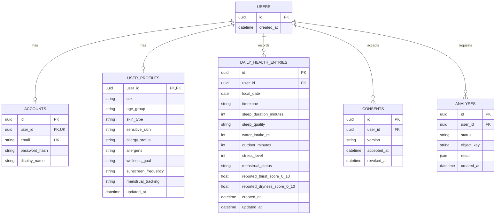

# Proposed user data schema

**สถานะ: ข้อเสนอสำหรับแก้ไข ยังไม่ได้ implement**
อ้างอิง schema ที่ใช้งานอยู่: [database-er.md](database-er.md) และ [SQLAlchemy models](../../../backend/core/db/models.py)

## เป้าหมาย

แยกข้อมูลที่เปลี่ยนไม่บ่อยออกจากคำตอบที่เกิดซ้ำตามวัน และให้ข้อมูลรายวันทุกแถวผูกกับ `users.id` ของบัญชีที่ล็อกอินอยู่

แผนภาพแสดงเฉพาะคอลัมน์ที่เกี่ยวกับการตัดสินใจนี้; คอลัมน์อื่นของ `accounts`, `consents`, `analyses` และผลทำนายใน `daily_health_entries` ยังใช้ตาม schema ปัจจุบัน

## ข้อกำหนดของข้อมูล

| ตาราง | ข้อกำหนด |
|---|---|
| `users` / `accounts` | ใช้โครงสร้างเดิม; `accounts.user_id` และ `accounts.email` ต้อง unique |
| `user_profiles` | หนึ่งแถวต่อ `user_id`; ฟิลด์แก้ไขได้ ไม่ถือว่า `sex` หรือ `age_group` เปลี่ยนไม่ได้ตลอดชีวิต; ใช้ค่า enum/validation เดียวกับฟอร์ม |
| `daily_health_entries` | หนึ่งแถวต่อ `(user_id, local_date)` ด้วย unique constraint; `local_date` คือวันที่ผู้ใช้รายงานใน `timezone` ที่บันทึกไว้; การส่งซ้ำของวันเดียวกันเป็น upsert |
| ค่ารายวัน | `sleep_duration_minutes` 0–540, `water_intake_ml` 0–20,000, `outdoor_minutes` 0–1,440, `stress_level` 1–5; nullable ได้สำหรับคำถามที่ยังไม่ได้ตอบ ไม่เติมค่า 0 แทนข้อมูลที่ไม่มี |
| ผลทำนาย | ฟิลด์ `predicted_*` และ `prediction_status` ที่มีอยู่ต้องแยกความหมายจาก `reported_*` ซึ่งเป็นคำตอบจริงของผู้ใช้; ห้ามนำผลทำนายไปใช้เป็น label จริง |
| ความยินยอม | เก็บใน `consents` ตามเดิม และตรวจ consent ก่อนบันทึกข้อมูลรายวัน |

`sunscreen_frequency` เป็นพฤติกรรมโดยรวม จึงอยู่ในโปรไฟล์ ถ้าต้องการถามว่า **วันนี้ทากันแดดหรือไม่** ให้เพิ่มฟิลด์รายวันชื่อ `sunscreen_used` แยกต่างหาก ส่วน `menstrual_tracking` เป็นการเลือกเปิดติดตาม และ `menstrual_status` เป็นคำตอบที่มีวันที่กำกับ

ถ้าเก็บ `stress_level` รายวัน ให้เปลี่ยนคำถามจาก “ช่วงสัปดาห์นี้” เป็น “วันนี้” เพื่อให้ตรงกับ `local_date` ผู้ใช้กลุ่ม `under_13` ยังต้องมีหลักฐาน guardian consent ตามกติกาปัจจุบัน โดยเก็บและตรวจผ่าน `consents` ก่อนบันทึกข้อมูล

## สิ่งที่ต้องแก้จากระบบปัจจุบัน

1. [แบบสอบถามตอนสมัคร](../../../frontend/src/app/signup/page.tsx) ถามการนอน น้ำดื่ม และเวลาออกกลางแจ้งของ “เมื่อวาน” แต่ [API](../../../backend/api/v1/routes/questionnaires.py) เก็บรวมใน `questionnaires.answers` โดยไม่มี `local_date` ของคำตอบ ให้ย้ายคำถามเหล่านี้ไปยังการบันทึกรายวัน หรือสร้างรายการของวันที่ผู้ใช้ระบุระหว่าง onboarding
2. [daily tracker API ฝั่งเว็บ](../../../frontend/src/app/api/daily-health/entries/route.ts) สร้าง pseudonymous user ใหม่เมื่อยังไม่มี cookie ให้ใช้ `user_id` จาก session ของบัญชีที่ล็อกอินอยู่ เพื่อให้ประวัติรายวันเป็นของบัญชีเดียวกัน
3. [ตารางรายวันปัจจุบัน](../../../backend/core/db/models.py) ใช้ `outdoor_exposure_choice` (ช่วง 1–4) แต่ onboarding ใช้ `outdoor_minutes` (จำนวนนาที) ให้เก็บค่านาทีจริงเป็น source of truth และแปลงเป็นช่วงเฉพาะจุดที่โมเดลยังต้องการค่า 1–4
4. `daily_lifestyle_observations` และ `daily_health_entries` เก็บข้อมูลการนอน น้ำ และ outdoor ที่ทับซ้อนกัน ให้ใช้ `daily_health_entries` เป็นข้อมูลรายวันที่ผู้ใช้กรอก และปรับ forecast ให้อ่านจากตารางนี้ ก่อนพิจารณาย้าย/เลิกใช้ตารางเดิม; `analyses` ยังเก็บผลวิเคราะห์ภาพแยกต่างหาก
5. ย้ายการอ่านโปรไฟล์สำหรับหน้า recommendation จาก `questionnaires.answers` ไป `user_profiles` เมื่อ backfill เสร็จ `questionnaires` อาจเก็บไว้เป็นประวัติแบบสอบถาม แต่ไม่ใช่แหล่งข้อมูลรายวันล่าสุด
6. ปรับ [fixture](../../../fixtures/users.yaml) ให้มี `profile` และ `daily_entries` ที่ระบุวันที่ชัดเจน โดยใช้ `user_id` เดียวกับบัญชี demo

## การย้ายข้อมูลและเกณฑ์ตรวจรับ

- เพิ่มตาราง/คอลัมน์ด้วย migration และ backfill เฉพาะค่าที่ระบุความหมายได้แน่ชัด; คำตอบ “เมื่อวาน” ใน questionnaire เก่าไม่มีวันที่รายงานที่ชัดเจน จึงไม่ควรเดาวันย้อนหลังแล้วนำไปเป็นข้อมูล time series
- บัญชีหนึ่งบันทึกข้อมูลได้หลายวัน และการบันทึกวันเดิมซ้ำต้องแก้แถวเดิม ไม่เพิ่มแถวใหม่
- เมื่อผู้ใช้ล็อกอินแล้วบันทึกรายวัน แถวที่ได้ต้องมี `user_id` เท่ากับบัญชีที่ล็อกอิน
- คำตอบโปรไฟล์แก้ไขได้โดยไม่เปลี่ยนแถวรายวันย้อนหลัง; คำตอบรายวันแก้ไขได้ตามวันที่
- ทดสอบว่าค่าที่ไม่ตอบยังเป็น `NULL`, นาทีออกกลางแจ้งคงหน่วยเดิม และผลทำนายไม่ถูกใช้เป็นคำตอบจริง
