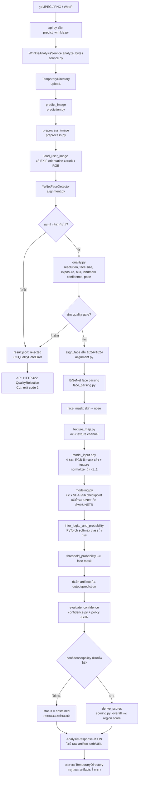

# การไหลของข้อมูลภาพสู่ AI

เอกสารนี้อธิบายเส้นทางของรูปถ่ายตั้งแต่อัปโหลดจนได้ผลวิเคราะห์ โดยอ้างอิงจากโค้ดใน repository นี้ ณ ปัจจุบัน

> สถานะสำคัญ: Platform API เชื่อมกับ FFHQ-Wrinkle pipeline ผ่าน inference worker แล้ว
>
> - **Platform API** (`backend/`) รับรูป เก็บรูปใน MinIO จัดคิว และให้ worker เรียกโมเดล
> - **Wrinkle pipeline** (`ai/ffhq_wrinkle/`) ใช้ได้ทั้งจาก worker, CLI และ FastAPI adapter โดยเก็บ artifacts ระหว่าง inference ไว้ชั่วคราว

## 1. เส้นทางรูปใน Platform API ที่รันด้วย Docker Compose

```mermaid
flowchart TD
    U[ผู้ใช้ / Web client] -->|multipart image| R[POST /api/v1/analyses/users/{user_id}\nbackend/api/v1/routes/analyses.py]
    R --> S[create_analysis\nbackend/services/analysis_service.py]
    S --> C{มี consent ที่ยังใช้งานอยู่?}
    C -->|ไม่ใช่| X1[403: ไม่รับรูป]
    C -->|ใช่| V{ชนิดและขนาดไฟล์ถูกต้อง?\nJPEG / PNG / WebP, ไม่เกิน max_upload_bytes}
    V -->|ไม่ใช่| X2[415 หรือ 413: ไม่รับรูป]
    V -->|ใช่| Q[image_quality_flags\nตรวจเปิดไฟล์ได้, ความละเอียด, อัตราส่วน]
    Q --> M[(MinIO: aphrodize-private\nusers/{user_id}/original/{uuid})]
    Q --> D[(PostgreSQL: analyses\nmetadata, object_key, quality_flags, status)]
    Q --> G{ผ่าน preflight quality gate?}
    G -->|ไม่ผ่าน| REJ[status = rejected\nerror_category = image_quality]
    G -->|ผ่าน| J[Redis / ARQ queue: inference\njob run_inference(analysis_id)]
    J --> W[inference-worker\nbackend/workers/inference_worker.py]
    W --> AI[อ่านรูปจาก MinIO\nWrinkleAnalysisService.analyze_bytes]
    AI --> F[status = completed / rejected / failed\nresult = public AI response]
    F --> D
    U -->|GET /api/v1/analyses/{analysis_id}| R
    R -->|อ่านสถานะ/ผลลัพธ์| D
    D --> U
```

### ไฟล์และหน้าที่ในเส้นทางนี้

| ไฟล์ | หน้าที่ | ข้อมูลที่ส่งต่อ/จัดเก็บ |
|---|---|---|
| `backend/api/v1/routes/analyses.py` | นิยาม endpoint รับ `UploadFile`, ตรวจว่ามี user และคืนสถานะ analysis | รับรูปจาก HTTP แล้วส่งต่อไป service; endpoint GET อ่านผล |
| `backend/services/analysis_service.py` | ตรวจ consent, MIME type, ขนาดไฟล์ และ preflight quality; สร้าง analysis และ enqueue งาน | bytes ของรูป → MinIO; metadata/status → PostgreSQL; `analysis.id` → Redis |
| `backend/libs/minio_client.py` | wrapper สำหรับอ่าน/เขียน object ใน MinIO | รูปต้นฉบับเป็น private object; key รูปแบบ `users/<user_id>/original/<uuid>` |
| `backend/core/db/models.py` | นิยามตาราง SQLAlchemy | `analyses` เก็บ object key, content type, quality flags, model version, status และ result แต่ไม่เก็บ bytes ของรูป |
| `backend/libs/redis_client.py` | สร้าง connection ไป Redis สำหรับ ARQ | ส่ง job ชื่อ `run_inference` ไป queue `inference` |
| `backend/workers/inference_worker.py` | consumer ของ inference queue | อ่านรูปจาก MinIO เรียก `WrinkleAnalysisService` และบันทึกผลลัพธ์ที่ปลอดภัยลง PostgreSQL |
| `backend/api/schemas/analysis.py` | กำหนด response ของ API | ส่ง id, status, quality flags, result และ error category กลับผู้ใช้ |

### การประมวลผลใน worker

`run_inference()` อ่านรูปด้วย `get_bytes()` แล้วเรียก pipeline ใน thread แยกจาก event loop ผล public response ถูกเขียนลง `Analysis.result`; raw mask และ probability artifacts ยังคงเป็นไฟล์ชั่วคราวและถูกลบเมื่อจบงาน

## 2. เส้นทาง AI วิเคราะห์ริ้วรอยที่มีอยู่ใน `ai/ffhq_wrinkle`

เส้นทางนี้เรียกได้ผ่าน CLI `ai/scripts/predict_wrinkle.py` หรือ API แยก `backend/wrinkle/api.py` ที่ endpoint `POST /v1/wrinkle/analyze` (ต้องส่ง `consent_accepted=true`) เมื่อมี checkpoints ที่ถูกต้อง



## 3. ไฟล์สำคัญของ pipeline AI และผลลัพธ์ระหว่างทาง

| ลำดับ | ไฟล์ | หน้าที่ | ผลลัพธ์/ข้อมูลสำคัญ |
|---:|---|---|---|
| 1 | `backend/wrinkle/api.py` | FastAPI adapter; ตรวจ consent, content type, ขนาดไม่เกิน 10 MiB และเรียก service ใน threadpool | รับ `UploadFile` แล้วคืน JSON หรือ 422 หาก quality ไม่ผ่าน |
| 2 | `backend/wrinkle/service.py` | orchestrator สำหรับภาพหนึ่งรูป; สร้าง temporary directory, cache model ใน memory และประกอบ public response | รูป/artefacts ดิบอยู่ชั่วคราวเท่านั้น; response ไม่เปิด URL ของ artifacts |
| 3 | `ai/ffhq_wrinkle/preprocess.py` | โหลดภาพ, ตรวจคุณภาพ, align, face parsing, mask และสร้าง input tensor | `aligned_face.png`, `face_mask.png`, `masked_face.png`, `texture_map.png`, `model_input.npy`, `result.json` |
| 4 | `ai/ffhq_wrinkle/alignment.py` | ตรวจใบหน้าด้วย YuNet และใช้ 5 landmarks จัดแนวใบหน้า | ต้องพบเพียง 1 ใบหน้า; ภาพ align ขนาด 1024×1024 |
| 5 | `ai/ffhq_wrinkle/quality.py` | quality gate ของภาพและ face mask | flags เช่น รูปเล็ก/เบลอ, แสงไม่เหมาะ, มุมหน้าเกิน, ไม่มีหรือหลายใบหน้า |
| 6 | `ai/ffhq_wrinkle/face_parsing.py` และ `bisenet.py` | โหลด BiSeNet 19 classes แล้วสร้าง mask เฉพาะ skin กับ nose | boolean `face_mask`; หาก parsing ล้มเหลวจะ reject |
| 7 | `ai/ffhq_wrinkle/texture_map.py` | สร้าง texture channel ตามขั้นตอนงานวิจัย | image 1 channel ขนาดเดียวกับใบหน้าที่ align |
| 8 | `ai/ffhq_wrinkle/modeling.py` | เลือก CPU/CUDA, ตรวจขนาดและ SHA-256 ของ checkpoint แล้วโหลดแบบ strict | `ModelBundle` ของ `UNet` หรือ `SwinUNETR`; ปฏิเสธ checkpoint ที่ไม่ตรง artifact ทางการ |
| 9 | `ai/ffhq_wrinkle/prediction.py` | รัน PyTorch, softmax, threshold, จำกัด mask ให้อยู่ในส่วนหน้า และสร้าง overlay | `wrinkle_logits.npy`, `wrinkle_probability.npy/.png`, `wrinkle_mask.png`, `overlay.png`, `result.json` |
| 10 | `ai/ffhq_wrinkle/confidence.py` และ `confidence_policy.json` | วัด decision margin และบังคับ policy/lineage gate | หากยังไม่ calibrated (ค่าเริ่มต้นใน repository) จะไม่ผ่าน gate |
| 11 | `ai/ffhq_wrinkle/scoring.py` | สร้างคะแนนพื้นที่ 0–100 ทั้งภาพรวมและ 8 regions เมื่อ gate ผ่าน | `derived_score` พร้อม area ratio และ disclaimer |
| 12 | `backend/wrinkle/schemas.py` | Pydantic schema ที่จำกัดข้อมูล public | `AnalysisResponse`: model metadata, confidence, score, recommendations, limitations |

## 4. Artifact ที่ถูกสร้างใน pipeline AI

```text
<output>/
├── aligned_face.png            # ใบหน้าหลังจัดแนว
├── face_mask.png               # mask ผิวหนังและจมูก
├── masked_face.png             # รูป RGB นอก mask ถูกปิดเป็นศูนย์
├── texture_map.png             # texture channel
├── model_input.npy             # tensor float32 [4, H, W] สำหรับโมเดล
├── wrinkle_logits.npy          # logits ดิบ 2 classes
├── wrinkle_probability.npy     # probability ดิบของ class ริ้วรอย
├── wrinkle_probability.png     # probability map สำหรับดูภาพ
├── wrinkle_mask.png            # binary wrinkle mask หลัง threshold
├── overlay.png                 # แสดง mask ทับบนรูป align
└── result.json                 # metadata, quality, model, threshold และชื่อ artifacts
```

เมื่อเรียกผ่าน `WrinkleAnalysisService.analyze_bytes()` `<output>` คือ temporary directory ชื่อ `prediction/` และถูกลบเมื่อจบ request; จึงไม่ถูกส่งขึ้น MinIO หรือเปิดให้ผู้ใช้ดาวน์โหลด สำหรับ CLI `<output>` คือค่าที่ระบุใน `--output` และไฟล์จะคงอยู่ตามปกติ

## 5. เงื่อนไขผลลัพธ์และขอบเขตความปลอดภัย

| เงื่อนไข | ผลที่ API AI คืน |
|---|---|
| รูป/ใบหน้าไม่ผ่าน quality gate | HTTP 422 พร้อม `quality_flags`; ไม่สร้าง model-ready tensor |
| ผ่าน quality แต่ confidence policy ไม่ calibrated หรือค่าต่ำ | `status: abstained`; งดคะแนนและคำแนะนำ |
| ผ่าน quality และ confidence/policy gate | `status: completed`; คืน probability/mask metadata, overall/regional area scores และคำแนะนำที่ผ่าน gate |
| Worker พบข้อผิดพลาดภายในหรือโมเดลไม่พร้อม | `status: failed`, `error_category: inference_failed` |

ผลลัพธ์นี้เป็นการ segment รูปแบบภาพที่เกี่ยวข้องกับริ้วรอย ไม่ใช่การวินิจฉัยทางการแพทย์ และรูปอัปโหลดของผู้ใช้ไม่ถูกนำไป train อัตโนมัติ

## 6. จุดเชื่อมกับ Platform API

Integration อยู่ใน `backend/workers/inference_worker.py` และทำงานดังนี้:

1. อ่านรูป private จาก MinIO ด้วย `backend.libs.minio_client.get_bytes(analysis.object_key)`
2. เรียก `WrinkleAnalysisService.analyze_bytes()` จาก `backend.wrinkle.service` โดยใช้ model checkpoint และ confidence policy ที่ผ่านการอนุมัติ
3. เขียนเฉพาะ response ที่ปลอดภัยและ metadata ที่จำเป็นลง `Analysis.result`; ตั้ง status เป็น `completed` หรือ `rejected/failed` ตามผล
4. ไม่อัปโหลด derived artifacts กลับ MinIO; service ลบไฟล์ชั่วคราวหลังงานเสร็จ
5. คงหลักการ fail closed: หาก checkpoint, hash หรือ policy ไม่ผ่าน จะไม่สร้าง score/recommendation
