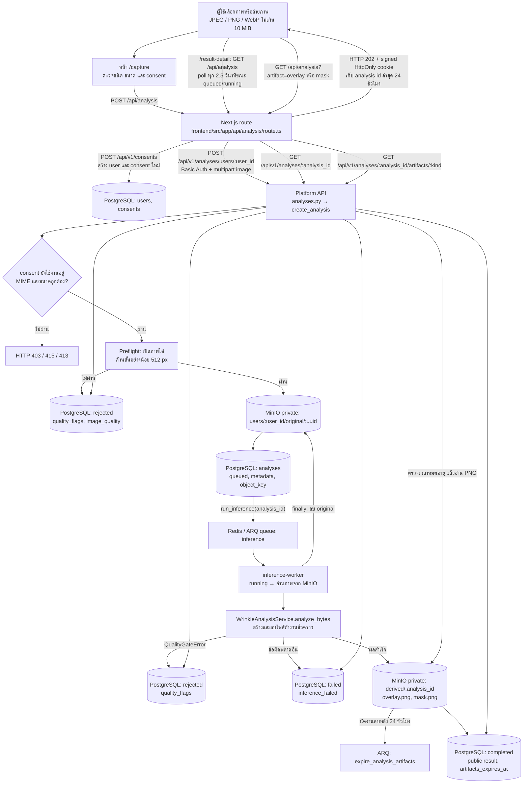
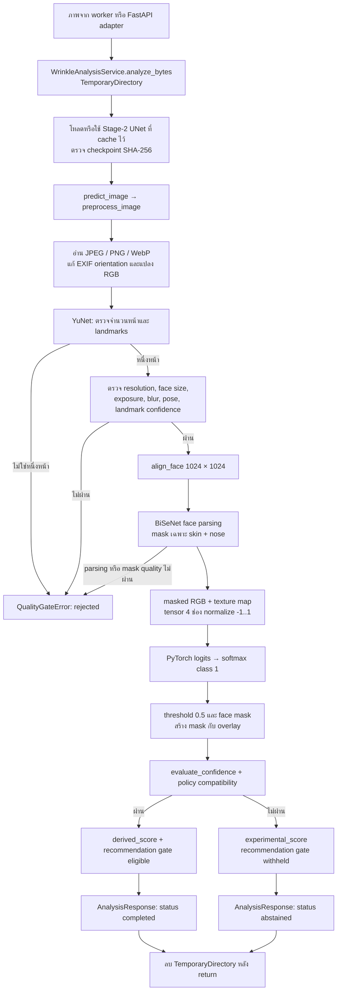

# การไหลของข้อมูลภาพสู่ AI

เอกสารนี้อธิบายพฤติกรรมจากโค้ดใน repository ปัจจุบัน เส้นทางหลักของเว็บคือ `frontend/src/app/capture/page.tsx` → Next.js route → Platform API → ARQ worker → FFHQ-Wrinkle pipeline ส่วน CLI และ FastAPI adapter เป็นทางเรียกแยกกัน

## 1. เส้นทางจากเว็บถึงผลวิเคราะห์

Next.js route ตรวจ origin, consent จากฟอร์ม, MIME และขนาดก่อนส่งต่อ จากนั้นเรียก `/consents` เพื่อสร้าง user/consent ใหม่ทุกครั้งที่ส่งภาพ แล้วใช้ Basic Auth ที่ฝั่ง server เรียก Platform API เบราว์เซอร์ได้รับ cookie ที่ลงลายเซ็นเพื่ออ่าน **analysis ล่าสุดของเบราว์เซอร์นั้น** ผ่าน proxy เท่านั้น ไม่ได้ส่ง Basic Auth ให้เบราว์เซอร์

`create_analysis()` ตรวจ active consent อีกชั้นและทำ preflight ด้วย Pillow หากภาพเปิดไม่ได้หรือด้านสั้นต่ำกว่า 512 px จะบันทึก analysis เป็น `rejected` โดย **ไม่เก็บ bytes ใน MinIO และไม่เข้าคิว** ภาพที่ผ่านเท่านั้นจึงถูกเก็บเป็น original, สร้างแถว `queued` แล้วเข้าคิว `run_inference`

Worker อ่าน original และเรียก service ใน thread แยกจาก event loop เมื่อได้ผล จะเก็บเฉพาะ `overlay.png` กับ `wrinkle_mask.png` (ชื่อ object `mask.png`) ใน MinIO, นัดงานลบหลัง 24 ชั่วโมง และบันทึก public response กับ `artifacts_expires_at` ลง PostgreSQL ไม่เก็บ logits/probability ดิบใน MinIO ไม่ว่าผลสำเร็จ ถูกปฏิเสธ หรือผิดพลาด worker พยายามลบ original ใน `finally`; หากอัปโหลดภาพผลได้บางส่วนแล้วเกิดข้อผิดพลาด จะพยายามลบส่วนที่อัปโหลดด้วย

API ภาพผลตอบเฉพาะ `overlay`/`mask` เมื่อยังไม่หมดอายุจากเวลาใน result และอ่าน object private จาก MinIO หลังหมดอายุคืน HTTP 410; งาน ARQ ลบ object ทั้งสองเมื่อถึงกำหนด หน้า `/result-detail` แสดงคะแนนและภาพผลผ่าน Next.js proxy

## 2. การประมวลผลภาพใน FFHQ-Wrinkle

`WrinkleAnalysisService` เขียน source และ artifacts ดิบลง temporary directory, cache model ใน memory แล้วส่ง public response ที่ไม่มี path/URL ของไฟล์ดิบ หาก worker ส่ง `artifact_sink` service จะคัดลอก bytes ของ overlay และ mask ออกมาก่อนลบ directory

ค่าเริ่มต้นใน `ai/ffhq_wrinkle/confidence_policy.json` ยังเป็น `not_calibrated` จึงไม่ผ่าน confidence gate: service คืน `status: abstained`, `experimental_score` และไม่มีคำแนะนำ **แต่ worker บันทึกสถานะของงานในตาราง `analyses` เป็น `completed`** เพราะ pipeline ทำงานสำเร็จ หน้าเว็บจึงยังแสดงคะแนนทดลองและภาพผลได้ `derived_score` และคำแนะนำจะเกิดได้เมื่อ policy ที่ปล่อยใช้งานผ่าน gate เท่านั้น

### 2.1 ไล่โค้ดตามลำดับที่ worker เรียก

เริ่มอ่านจาก `backend/workers/inference_worker.py:run_inference()` แล้วตามฟังก์ชันในคอลัมน์แรก คำว่า *array* ด้านล่างหมายถึงข้อมูลในหน่วยความจำ ไม่ใช่ไฟล์บนดิสก์

| ลำดับและฟังก์ชัน | ไฟล์ต้นทาง | รับอะไร → ส่งอะไรต่อ | อ่าน/เขียนไฟล์ |
|---|---|---|---|
| 1. `startup()` | `backend/workers/inference_worker.py` | สร้าง `WrinkleAnalysisService` ไว้ใน `ctx["wrinkle_service"]` หนึ่งครั้งต่อ worker | service อ่าน `ai/ffhq_wrinkle/confidence_policy.json` หรือ policy bundle จาก `APHRODIZE_WRINKLE_POLICY_BUNDLE` |
| 2. `run_inference()` | `backend/workers/inference_worker.py` | รับ `analysis_id` → อ่านแถว `Analysis` → `get_bytes(analysis.object_key)` ได้ภาพเป็น `bytes`; เลือก suffix จาก content type | อ่าน original จาก MinIO; เปลี่ยนสถานะใน PostgreSQL จาก `queued` เป็น `running` |
| 3. `analyze_bytes()` และ `_bundle()` | `backend/wrinkle/service.py` | รับภาพ `bytes`, suffix และ `artifact_sink` → สร้าง `upload.jpg/png/webp`; โหลด/ใช้ `ModelBundle` ที่ cache ไว้ → เรียก `predict_image()` | temporary directory ชื่อ `aphrodize-wrinkle-*`; `modeling.py:load_wrinkle_model()` อ่าน checkpoint Stage-2 และตรวจขนาด/SHA-256 ก่อนประมวลผลภาพครั้งแรก |
| 4. `predict_image()` → `preprocess_image()` → `load_user_image()` | `ai/ffhq_wrinkle/prediction.py`, `preprocess.py` | ส่ง path ของ `upload` กับ path ของ `prediction/` → เปิดภาพ แก้ EXIF orientation แปลงเป็น RGB `uint8` array รูปทรง `[H, W, 3]` | อ่าน `upload.*`; เตรียม `prediction/` |
| 5. `YuNetFaceDetector.detect()` → `assess_source_quality()` | `ai/ffhq_wrinkle/alignment.py`, `quality.py` | RGB array → รายการ `FaceDetection` (กรอบหน้า, 5 landmarks, confidence) → `QualityAssessment`; ต้องพบหนึ่งหน้าและผ่านขนาดหน้า แสง ความคม และมุมหน้า | อ่าน `storage/models/ffhq-wrinkle/face_detection_yunet_2023mar.onnx`; หากไม่ผ่าน `_reject()` เขียน `prediction/result.json` แล้วโยน `QualityGateError` โดยยังไม่สร้าง `model_input.npy` |
| 6. `align_face()` | `ai/ffhq_wrinkle/alignment.py` | RGB array + `FaceDetection` → RGB array ที่จัดแนวเป็น `[1024, 1024, 3]` | ยังเป็น array; ภายหลังบันทึก `prediction/aligned_face.png` |
| 7. `load_bisenet()` → `parse_face()` → `face_mask_from_labels()` → `assess_face_mask()` | `ai/ffhq_wrinkle/face_parsing.py`, `preprocess.py`, `quality.py` | ใบหน้าที่จัดแนว → label map `[512, 512]` → mask แบบ boolean `[1024, 1024]` สำหรับ skin + nose → ตรวจสัดส่วนพื้นที่ mask | อ่าน `storage/models/ffhq-wrinkle/79999_iter.pth` บน CPU; ภายหลังบันทึก `prediction/face_mask.png`; parsing ล้มเหลวหรือพื้นที่ mask ผิดเกณฑ์จะ reject |
| 8. `mask_rgb_image()` → `generate_texture_map()` → `build_four_channel_tensor()` | `ai/ffhq_wrinkle/face_parsing.py`, `texture_map.py`, `preprocess.py` | RGB ที่จัดแนว + face mask → RGB นอกหน้าเป็นศูนย์ และ texture หนึ่งช่อง → tensor `float32 [4, 1024, 1024]` ที่ normalize เป็น `[-1, 1]` | เขียน `masked_face.png`, `texture_map.png`, `model_input.npy` และ `result.json` ใน `prediction/` |
| 9. `infer_logits_and_probability()` → `threshold_probability()` → `create_overlay()` | `ai/ffhq_wrinkle/prediction.py` | tensor → logits `[2, H, W]` → softmax probability ของ class 1 `[H, W]` → mask boolean ที่จำกัดให้อยู่ใน face mask → ภาพ overlay | เขียน `wrinkle_logits.npy`, `wrinkle_probability.npy/.png`, `wrinkle_mask.png`, `overlay.png`; อัปเดต `result.json`; คืน `PredictionResult` ที่ถือ arrays และ metadata |
| 10. `build_response()` → `evaluate_confidence()` → `derive_scores()` | `backend/wrinkle/service.py`, `ai/ffhq_wrinkle/confidence.py`, `scoring.py` | `PredictionResult.probability`, `.mask`, metadata และ face mask → ตรวจ confidence/policy → คะแนนรวมกับ 8 บริเวณ (`derived_score` หรือ `experimental_score`) → `AnalysisResponse` | service อ่าน `prediction/face_mask.png`; ส่ง bytes ของ `overlay.png` และ `wrinkle_mask.png` ให้ `artifact_sink`; จากนั้นลบ temporary directory ทั้งหมด |
| 11. `run_inference()` → `expire_analysis_artifacts()` | `backend/workers/inference_worker.py` | `AnalysisResponse` → JSON ใน `Analysis.result`; `artifact_sink` ให้ `dict[str, bytes]` ที่มี `overlay` และ `mask` | เขียน PNG สองไฟล์ใน MinIO `derived/`; ตั้งเวลาลบ 24 ชั่วโมง; พยายามลบ original จาก MinIO ใน `finally` |

**ลำดับโหลดโมเดล:** ในเส้นทาง worker/adapter, Python ประเมิน `self._bundle()` ก่อนเรียก `predict_image()` จึงโหลด Stage-2 checkpoint ก่อน preprocess ใน request แรก และใช้ model ที่ cache ใน request ต่อไป ส่วน CLI `ai/scripts/predict_wrinkle.py` เรียก `predict_image()` ตรง ๆ จึง preprocess ก่อนโหลด checkpoint

### 2.2 จุดที่ข้อมูลเปลี่ยนชนิด

`ภาพ bytes` → `RGB uint8 [H,W,3]` → `aligned RGB [1024,1024,3]` → `face mask bool [1024,1024]` → `RGB+texture float32 [4,1024,1024]` → `logits [2,1024,1024]` → `probability [1024,1024]` → `wrinkle mask + overlay` → `AnalysisResponse JSON`

`PredictionResult` และ `PreprocessResult` เป็น dataclass ที่ส่ง arrays ระหว่างฟังก์ชันใน process เดียว ไฟล์ PNG/NPY ใน `prediction/` ใช้เป็น artifacts ระหว่างงานและสำหรับ CLI; ฝั่งเว็บเก็บถาวรชั่วคราวเฉพาะ overlay/mask ใน MinIO และ metadata/result ใน PostgreSQL

### 2.3 ไฟล์ประกอบที่ควรเปิดอ่านคู่กัน

| ไฟล์ | จุดที่ใช้และหน้าที่ |
|---|---|
| `ai/ffhq_wrinkle/paths.py` | นิยาม `MODEL_ROOT` เป็น `storage/models/ffhq-wrinkle/` สำหรับหาไฟล์โมเดล |
| `ai/ffhq_wrinkle/modeling.py` | `default_checkpoint()` เลือกไฟล์ Stage-2; `load_wrinkle_model()` ตรวจไฟล์, SHA-256, เลือก CPU/CUDA และโหลด weights แบบ strict |
| `ai/ffhq_wrinkle/official/unet/unet_model.py`, `swin_unetr.py` | นิยามสถาปัตยกรรม segmentation ที่ `modeling.py` สร้าง; worker ใช้ UNet ตามค่าเริ่มต้น |
| `ai/ffhq_wrinkle/bisenet.py` | นิยามโมเดล face parsing 19 classes ซึ่ง `face_parsing.py:load_bisenet()` โหลด weights เข้าไป |
| `ai/ffhq_wrinkle/confidence_policy.json` | นโยบาย confidence ค่าเริ่มต้น; `confidence.py:load_confidence_policy()` อ่านตอนสร้าง service; ปัจจุบันเป็น `not_calibrated` |
| `backend/wrinkle/schemas.py` | `AnalysisResponse` ตรวจรูปแบบ public JSON ก่อน service ส่งให้ worker; ไม่มี path หรือ URL ของ raw artifacts |

## 3. Artifacts และอายุข้อมูล

| ตำแหน่ง | ข้อมูล | อายุ/การเข้าถึง |
|---|---|---|
| MinIO `users/<user_id>/original/<uuid>` | ภาพต้นฉบับที่ผ่าน preflight | private; worker พยายามลบหลังจบงานทุกสถานะ |
| TemporaryDirectory ของ service (`prediction/`) | `aligned_face.png`, `face_mask.png`, `masked_face.png`, `texture_map.png`, `model_input.npy`, `wrinkle_logits.npy`, `wrinkle_probability.npy/.png`, `wrinkle_mask.png`, `overlay.png`, `result.json` | ลบหลัง `analyze_bytes()` จบ |
| MinIO `users/<user_id>/derived/<analysis_id>/overlay.png` และ `mask.png` | ภาพผลสองชนิดที่ worker คัดลอกออกจาก service | private; API ปฏิเสธหลัง 24 ชั่วโมง และ ARQ มีงานลบ object |
| PostgreSQL `analyses` | metadata, `object_key`, status, quality flags, public response และเวลาหมดอายุภาพผล | ไม่มี bytes ของภาพหรือ raw model arrays |

ไฟล์ภายใน temporary directory ที่ AI สร้างจริงมีดังนี้ (`prediction/` คือ output directory ที่ `predict_image()` ส่งให้ `preprocess_image()`):

| ไฟล์ใน `prediction/` | ฟังก์ชันที่เขียน | ใช้ทำอะไรต่อ |
|---|---|---|
| `aligned_face.png` | `preprocess_image()` | ภาพหน้าที่จัดแนว; ใช้ดูผลการ align และเป็นพื้นหลังของ overlay |
| `face_mask.png` | `preprocess_image()` | ขอบเขต skin + nose; service อ่านกลับเป็น boolean mask เพื่อวัด confidence และคะแนน |
| `masked_face.png` | `preprocess_image()` | RGB ที่ปิดพิกเซลนอก face mask; เป็นสามช่องแรกของ tensor |
| `texture_map.png` | `preprocess_image()` | ช่อง texture ที่เป็นช่องที่สี่ของ tensor |
| `model_input.npy` | `preprocess_image()` | สำเนา tensor `float32 [4, 1024, 1024]`; inference ใช้ array `PreprocessResult.tensor` โดยตรง |
| `wrinkle_logits.npy` | `predict_image()` | ค่าออกดิบของโมเดลสอง classes; ไม่ส่งให้ผู้ใช้ |
| `wrinkle_probability.npy`, `wrinkle_probability.png` | `predict_image()` | probability ของ class ริ้วรอยแบบตัวเลขดิบและภาพสำหรับตรวจดู; confidence ใช้ array `PredictionResult.probability` โดยตรง |
| `wrinkle_mask.png` | `predict_image()` | mask หลัง threshold; service คัดลอก bytes ให้ worker เก็บเป็น `derived/<analysis_id>/mask.png` |
| `overlay.png` | `predict_image()` | แสดง mask ซ้อนบนใบหน้าที่จัดแนว; service คัดลอก bytes ให้ worker เก็บเป็น `derived/<analysis_id>/overlay.png` |
| `result.json` | `preprocess_image()` แล้ว `predict_image()` เขียนทับ | metadata ของแต่ละช่วงและชื่อ artifacts; หาก quality gate ไม่ผ่าน `_reject()` เขียนสถานะ `rejected` แทน และไม่สร้าง tensor |

## 4. จุดเรียกแยกและสถานะผลลัพธ์

| ทางเรียก | พฤติกรรม |
|---|---|
| เว็บ `/capture` → `/api/analysis` | เส้นทางหลักตามข้อ 1; หน้า `/result-detail` poll สถานะและขอภาพผลผ่าน cookie ที่ลงลายเซ็น |
| `backend/wrinkle/api.py` | FastAPI adapter แยกที่ `POST /v1/wrinkle/analyze`; ต้องส่ง `consent_accepted=true`, จำกัด 10 MiB, quality fail คืน HTTP 422; **ไม่ได้ mount ใน `backend/main.py` หรือ Compose ปัจจุบัน** และไม่เก็บภาพผลใน MinIO |
| `ai/scripts/predict_wrinkle.py` | CLI เรียก `predict_image()` โดยตรง ไม่ผ่าน confidence/scoring service; artifacts คงอยู่ใน `--output`, quality fail exit code 2 |
| `POST /api/v1/inference/runs` | เส้นทาง generic สำหรับโมเดลชนิดอื่น; `run_model_inference` ปัจจุบันคืน `model_not_deployed` ไม่ใช่เส้นทางวิเคราะห์ภาพนี้ |

| เงื่อนไขในเส้นทางหลัก | สถานะ analysis / ผลที่ผู้ใช้เห็น |
|---|---|
| Preflight หรือ quality gate ของ pipeline ไม่ผ่าน | `rejected`, `error_category: image_quality`, พร้อม `quality_flags` |
| Pipeline ผ่าน แต่ confidence policy ไม่ผ่าน | analysis `completed`, result `status: abstained`, มี `experimental_score` และภาพผล; ไม่มีคำแนะนำ |
| Pipeline และ confidence policy ผ่าน | analysis `completed`, result `status: completed`, มี `derived_score`; คำแนะนำยังขึ้นกับ provider และ safety gate |
| Worker หรือ model ล้มเหลว | `failed`, `error_category: inference_failed` |

ผล segmentation และคะแนนพื้นที่เป็นผลทดลอง ไม่ใช่การวินิจฉัยทางการแพทย์ ภาพอัปโหลดของผู้ใช้ไม่ถูกนำไป train อัตโนมัติ
