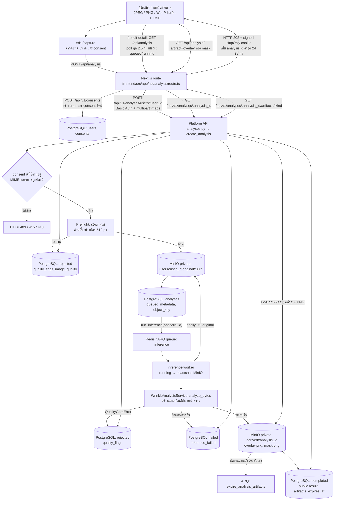
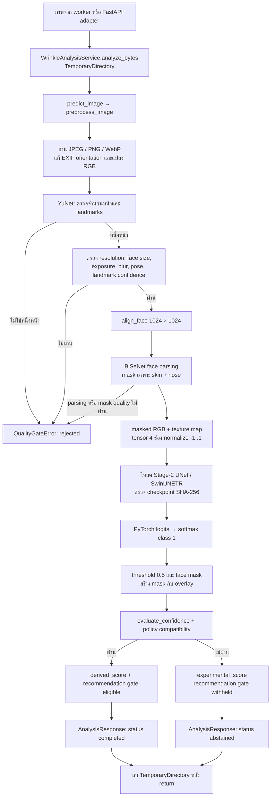

# การไหลของข้อมูลภาพสู่ AI

เอกสารนี้อธิบายพฤติกรรมจากโค้ดใน repository ปัจจุบัน เส้นทางหลักของเว็บคือ `frontend/src/app/capture/page.tsx` → Next.js route → Platform API → ARQ worker → FFHQ-Wrinkle pipeline ส่วน CLI และ FastAPI adapter เป็นทางเรียกแยกกัน

## 1. เส้นทางจากเว็บถึงผลวิเคราะห์

Next.js route ตรวจ origin, consent จากฟอร์ม, MIME และขนาดก่อนส่งต่อ จากนั้นเรียก `/consents` เพื่อสร้าง user/consent ใหม่ทุกครั้งที่ส่งภาพ แล้วใช้ Basic Auth ที่ฝั่ง server เรียก Platform API เบราว์เซอร์ได้รับ cookie ที่ลงลายเซ็นเพื่ออ่าน **analysis ล่าสุดของเบราว์เซอร์นั้น** ผ่าน proxy เท่านั้น ไม่ได้ส่ง Basic Auth ให้เบราว์เซอร์

`create_analysis()` ตรวจ active consent อีกชั้นและทำ preflight ด้วย Pillow หากภาพเปิดไม่ได้หรือด้านสั้นต่ำกว่า 512 px จะบันทึก analysis เป็น `rejected` โดย **ไม่เก็บ bytes ใน MinIO และไม่เข้าคิว** ภาพที่ผ่านเท่านั้นจึงถูกเก็บเป็น original, สร้างแถว `queued` แล้วเข้าคิว `run_inference`

Worker อ่าน original และเรียก service ใน thread แยกจาก event loop เมื่อได้ผล จะเก็บเฉพาะ `overlay.png` กับ `wrinkle_mask.png` (ชื่อ object `mask.png`) ใน MinIO, นัดงานลบหลัง 24 ชั่วโมง และบันทึก public response กับ `artifacts_expires_at` ลง PostgreSQL ไม่เก็บ logits/probability ดิบใน MinIO ไม่ว่าผลสำเร็จ ถูกปฏิเสธ หรือผิดพลาด worker พยายามลบ original ใน `finally`; หากอัปโหลดภาพผลได้บางส่วนแล้วเกิดข้อผิดพลาด จะพยายามลบส่วนที่อัปโหลดด้วย

API ภาพผลตอบเฉพาะ `overlay`/`mask` เมื่อยังไม่หมดอายุจากเวลาใน result และอ่าน object private จาก MinIO หลังหมดอายุคืน HTTP 410; งาน ARQ ลบ object ทั้งสองเมื่อถึงกำหนด หน้า `/result-detail` แสดงคะแนนและภาพผลผ่าน Next.js proxy

## 2. การประมวลผลภาพใน FFHQ-Wrinkle

`WrinkleAnalysisService` เขียน source และ artifacts ดิบลง temporary directory, cache model ใน memory แล้วส่ง public response ที่ไม่มี path/URL ของไฟล์ดิบ หาก worker ส่ง `artifact_sink` service จะคัดลอก bytes ของ overlay และ mask ออกมาก่อนลบ directory

ค่าเริ่มต้นใน `ai/ffhq_wrinkle/confidence_policy.json` ยังเป็น `not_calibrated` จึงไม่ผ่าน confidence gate: service คืน `status: abstained`, `experimental_score` และไม่มีคำแนะนำ **แต่ worker บันทึกสถานะของงานในตาราง `analyses` เป็น `completed`** เพราะ pipeline ทำงานสำเร็จ หน้าเว็บจึงยังแสดงคะแนนทดลองและภาพผลได้ `derived_score` และคำแนะนำจะเกิดได้เมื่อ policy ที่ปล่อยใช้งานผ่าน gate เท่านั้น

## 3. Artifacts และอายุข้อมูล

| ตำแหน่ง | ข้อมูล | อายุ/การเข้าถึง |
|---|---|---|
| MinIO `users/<user_id>/original/<uuid>` | ภาพต้นฉบับที่ผ่าน preflight | private; worker พยายามลบหลังจบงานทุกสถานะ |
| TemporaryDirectory ของ service (`prediction/`) | `aligned_face.png`, `face_mask.png`, `masked_face.png`, `texture_map.png`, `model_input.npy`, `wrinkle_logits.npy`, `wrinkle_probability.npy/.png`, `wrinkle_mask.png`, `overlay.png`, `result.json` | ลบหลัง `analyze_bytes()` จบ |
| MinIO `users/<user_id>/derived/<analysis_id>/overlay.png` และ `mask.png` | ภาพผลสองชนิดที่ worker คัดลอกออกจาก service | private; API ปฏิเสธหลัง 24 ชั่วโมง และ ARQ มีงานลบ object |
| PostgreSQL `analyses` | metadata, `object_key`, status, quality flags, public response และเวลาหมดอายุภาพผล | ไม่มี bytes ของภาพหรือ raw model arrays |

## 4. จุดเรียกแยกและสถานะผลลัพธ์

| ทางเรียก | พฤติกรรม |
|---|---|
| เว็บ `/capture` → `/api/analysis` | เส้นทางหลักตามข้อ 1; หน้า `/result-detail` poll สถานะและขอภาพผลผ่าน cookie ที่ลงลายเซ็น |
| `backend/wrinkle/api.py` | FastAPI adapter แยกที่ `POST /v1/wrinkle/analyze`; ต้องส่ง `consent_accepted=true`, จำกัด 10 MiB, quality fail คืน HTTP 422; **ไม่ได้ mount ใน `backend/main.py` หรือ Compose ปัจจุบัน** และไม่เก็บภาพผลใน MinIO |
| `ai/scripts/predict_wrinkle.py` | CLI เรียก `predict_image()` โดยตรง ไม่ผ่าน confidence/scoring service; artifacts คงอยู่ใน `--output`, quality fail exit code 2 |
| `POST /api/v1/inference/runs` | เส้นทาง generic สำหรับโมเดลชนิดอื่น; `run_model_inference` ปัจจุบันคืน `model_not_deployed` ไม่ใช่เส้นทางวิเคราะห์ภาพนี้ |

| เงื่อนไขในเส้นทางหลัก | สถานะ analysis / ผลที่ผู้ใช้เห็น |
|---|---|
| Preflight หรือ quality gate ของ pipeline ไม่ผ่าน | `rejected`, `error_category: image_quality`, พร้อม `quality_flags` |
| Pipeline ผ่าน แต่ confidence policy ไม่ผ่าน | analysis `completed`, result `status: abstained`, มี `experimental_score` และภาพผล; ไม่มีคำแนะนำ |
| Pipeline และ confidence policy ผ่าน | analysis `completed`, result `status: completed`, มี `derived_score`; คำแนะนำยังขึ้นกับ provider และ safety gate |
| Worker หรือ model ล้มเหลว | `failed`, `error_category: inference_failed` |

ผล segmentation และคะแนนพื้นที่เป็นผลทดลอง ไม่ใช่การวินิจฉัยทางการแพทย์ ภาพอัปโหลดของผู้ใช้ไม่ถูกนำไป train อัตโนมัติ
