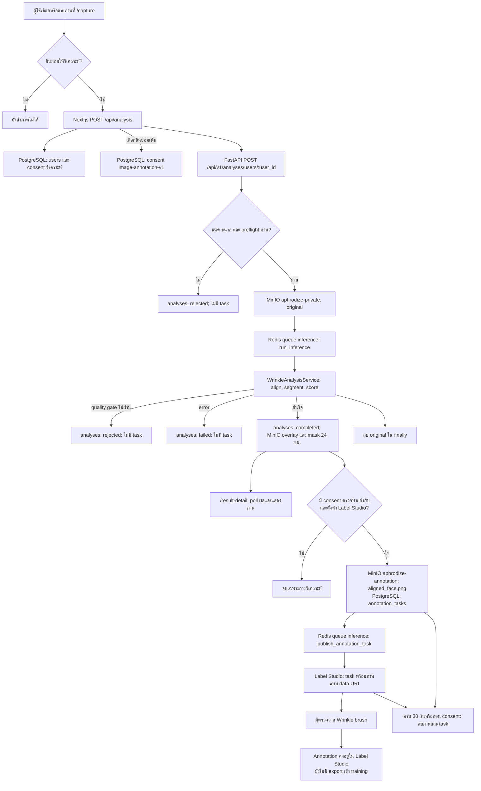

# วงจรภาพวิเคราะห์ → Label Studio → MLflow ของ Aphrodize

เอกสารนี้อธิบาย **สิ่งที่โค้ดทำอยู่จริง** จากหน้า `/capture` จนถึงการตรวจป้ายกำกับและเส้นทางฝึกโมเดล แยกการไหลของภาพผู้ใช้ออกจากข้อมูลฝึกภายนอก เพราะ consent สำหรับการตรวจภาพไม่ได้อนุญาตให้นำภาพไปฝึกโมเดล ดูขั้นตอนประมวลผลภาพระดับ tensor เพิ่มเติมใน [ai-photo-data-flow.md](ai-photo-data-flow.md)

## 1. ภาพรวมการไหล

`POST /api/analysis` ตอบ `202` หลังสร้าง analysis และคิวงานสำเร็จ **ไม่ได้รอ** AI หรือ Label Studio ทำงานเสร็จ หน้า `/result-detail` จึง poll สถานะ `queued → running → completed/rejected/failed` ทุก 2.5 วินาทีขณะยังทำงานอยู่ การที่หน้าแสดงผลวิเคราะห์แล้วไม่ได้ยืนยันว่ามี task ใน Label Studio; สองงานนี้แยกคิวกัน

## 2. ไล่ไฟล์ตามคำขอหนึ่งรูป

| ขั้น | ไฟล์ / ฟังก์ชัน | ข้อมูลที่รับและส่ง |
|---|---|---|
| 1. เลือกภาพ | `frontend/src/app/capture/page.tsx` → `submit()` | ตรวจ JPEG/PNG/WebP ไม่เกิน 10 MiB; ส่ง `image`, `consent=yes` และ `annotation_consent=yes` เฉพาะเมื่อเลือกช่องเพิ่มเติม |
| 2. Proxy และ consent | `frontend/src/app/api/analysis/route.ts` → `POST()` | ตรวจ origin/ไฟล์; เรียก backend `/consents` เพื่อสร้าง user และ consent วิเคราะห์; ถ้าเลือกเพิ่มจึงเรียก `/consents/users/{user_id}/annotations`; จากนั้นส่ง multipart ไป `/analyses/users/{user_id}`; เก็บ analysis ล่าสุดใน signed HttpOnly cookie |
| 3. API วิเคราะห์ | `backend/api/v1/routes/analyses.py` → `submit_analysis()`; `backend/services/analysis_service.py` → `create_analysis()` | ตรวจ active consent, MIME, ขนาด และ Pillow preflight; บันทึกแถว `analyses`; ถ้าผ่านเก็บ original ใน MinIO และ enqueue `run_inference` ใน Redis |
| 4. AI worker | `backend/workers/inference_worker.py` → `run_inference()` | รับเพียง `analysis_id`, อ่าน original จาก MinIO, เปลี่ยนสถานะเป็น `running`, เรียก service แล้วบันทึกผลหรือเหตุที่ปฏิเสธ/ล้มเหลว; ลบ original ใน `finally` |
| 5. ประมวลผลภาพ | `backend/wrinkle/service.py` → `analyze_bytes()`; `ai/ffhq_wrinkle/prediction.py` → `predict_image()`; `ai/ffhq_wrinkle/preprocess.py` → `preprocess_image()` | ใช้ temporary directory; ตรวจหน้า/คุณภาพ, align หน้า, สร้าง tensor 4 ช่อง, U-Net mask และคะแนน; ส่ง bytes ของ `overlay`, `mask`, `aligned_face` ให้ worker ก่อนลบไฟล์ชั่วคราว |
| 6. ผลให้ผู้ใช้ | `backend/workers/inference_worker.py` → `run_inference()`; `backend/api/v1/routes/analyses.py` → `get_analysis()`/`get_analysis_artifact()`; `frontend/src/app/result-detail/page.tsx` | เก็บ `result` JSON ใน PostgreSQL; เก็บ overlay/mask ใน MinIO 24 ชม.; หน้าเว็บ poll ผ่าน `GET /api/analysis` ซึ่ง proxy ไป backend และขอรูปผ่าน `?artifact=overlay|mask` |
| 7. เตรียมงานตรวจ | `backend/services/annotation_service.py` → `stage_annotation()` | ทำเฉพาะ analysis `completed` + มี `image-annotation-v1`; เก็บ `aligned_face.png` ใน bucket แยก, สร้างแถว `annotation_tasks`, enqueue งานส่ง Label Studio และงานลบหลัง 30 วัน |
| 8. ส่ง task | `backend/workers/inference_worker.py` → `publish_annotation_task()`; `backend/services/annotation_service.py` → `_publish()` | ใช้ `backend/libs/labelstudio_client.py`; ตรวจ task เดิมด้วย `analysis_id`, ส่งภาพเป็น `data:image/png;base64,...`; บันทึก `label_studio_task_id` ใน PostgreSQL |
| 9. คนตรวจ | `backend/scripts/setup_annotation_project.py` | สร้าง project `Aphrodize wrinkle mask review` พร้อม `Wrinkle` brush; ผู้ตรวจทำ annotation ใน Label Studio โดยตรง |

จุดแยกสำคัญ: worker บันทึก analysis เป็น `completed` เมื่อ pipeline ทำงานสำเร็จ แม้ confidence policy จะ abstain และแสดงได้เพียง `experimental_score`; การมี task รีวิวไม่ได้ขึ้นกับการมีคำแนะนำผลิตภัณฑ์ แต่ขึ้นกับ consent เพิ่มและการตั้งค่า Label Studio

## 3. ข้อมูลอยู่ที่ไหนและลบเมื่อไร

| ที่เก็บ | ข้อมูล | อายุและผู้ใช้ข้อมูล |
|---|---|---|
| PostgreSQL `consents` | consent วิเคราะห์และ `image-annotation-v1` แยกกัน | ใช้ตรวจสิทธิ์ก่อนสร้าง analysis/task และเมื่อถอนสิทธิ์ |
| PostgreSQL `analyses` | สถานะ, quality flags, ผล JSON, model version | ไม่มี bytes ภาพ; ใช้ poll ผลและ monitoring |
| MinIO `aphrodize-private` | original ชั่วคราว; `derived/<analysis_id>/overlay.png`, `mask.png` | original ลบเมื่อ worker จบ; ภาพผล API ปฏิเสธหลัง 24 ชม. และมี job ลบ object |
| MinIO `aphrodize-annotation` | `annotation/<analysis_id>/aligned_face.png` | สร้างเฉพาะมี consent รีวิว; นัดลบหลัง 30 วันหรือเมื่อต้องถอนสิทธิ์ |
| PostgreSQL `annotation_tasks` | `analysis_id`, object key, Label Studio task ID, เวลาหมดอายุ | เป็นตัวเชื่อมและใช้ retry/cleanup |
| Label Studio | task ที่มีภาพ aligned แบบ inline และ annotation ของคน | ลบ task เมื่อหมดอายุหรือถอนสิทธิ์; **ไม่ส่งไป training เอง** |
| Redis | ID ของงาน inference, publish, expire, training | คิวงาน ไม่เก็บภาพใน job payload |

เมื่อถอน consent หน้าเว็บเรียก `DELETE /api/analysis` → `DELETE /api/v1/consents/users/{user_id}/annotations` ใน `backend/api/v1/routes/consents.py`; service ลบภาพจาก MinIO และ task ใน Label Studio ถ้า Label Studio ล้มเหลว API คืน `503` และ worker `reconcile_annotation_tasks()` ลองจัดการงานค้างตอนเริ่มต้นและทุกชั่วโมง การลบข้อมูลภาพทั้งหมดใช้ `DELETE /api/v1/users/{user_id}/images` ใน `backend/api/v1/routes/users.py` ด้วย

## 4. เส้นทาง training และ MLflow ที่มีอยู่จริง

```mermaid
flowchart LR
    L["Label Studio annotations จากภาพผู้ใช้"] --> X["หยุด: ยังไม่มี export/approval เข้า training"]
    E["ชุดข้อมูลภายนอกที่มีสิทธิ์ใช้ฝึก"] --> D["storage/data/approved/:dataset_id<br/>manifest.json + .npy + mask .png"]
    D --> V["ตรวจ approval, สิทธิ์, SHA-256<br/>split ตาม subject และ preprocessing"]
    V --> API["POST /api/v1/training/runs<br/>approved://id@manifest_sha256"]
    API --> Q["Redis queue training"]
    Q --> W["trainer-worker: UNet 1-20 epochs"]
    W --> M["MLflow: params, train loss,<br/>validation/test Dice, IoU, checkpoint"]
    M --> C["training_runs: awaiting_approval"]
    C --> H["คนตรวจผลและอนุมัติ model"]
    H --> A["storage/models/ffhq-wrinkle/<br/>checkpoint + approved.json"]
    A --> S["ตั้ง APHRODIZE_WRINKLE_APPROVED_MANIFEST<br/>restart inference-worker"]
    S --> I["worker ตรวจสิทธิ์และ SHA-256<br/>แล้วโหลด checkpoint"]
    I --> MON["GET /api/v1/monitoring/analyses"]
```

ไฟล์ในเส้นทางนี้: `backend/api/v1/routes/training.py` รับคำขอ → `backend/services/training_service.py` ตรวจรูปแบบ URI/epochs และเข้าคิว → `backend/workers/trainer_worker.py` เปิด MLflow run → `backend/services/curated_training.py` ตรวจ dataset ทุกไฟล์, train, วัด Dice/IoU และ log checkpoint → `backend/wrinkle/approved_model.py` ตรวจ `approved.json` และ SHA-256 ก่อน `backend/wrinkle/service.py` โหลดโมเดลที่เลือก ส่วน `backend/api/v1/routes/monitoring.py` สรุปสถานะ, failure rate, quality flags และ p95 ตาม model version; ไม่ส่งภาพหรือ user ID

MLflow เก็บ run metadata ในฐาน `mlflow` บน PostgreSQL และ artifact ใน MinIO bucket `mlflow` ตาม `docker/mlflow-start.sh` ตัวฝึกสร้าง U-Net ใหม่จากชุดข้อมูลที่อนุมัติ; การฝึกสำเร็จได้เพียง **candidate** สถานะ `awaiting_approval` ไม่มีโค้ดที่เปลี่ยนเป็นโมเดลใช้งานทันที และ annotation จาก Label Studio ยังไม่เชื่อมไป dataset นี้ หากต้องการนำภาพผู้ใช้ไปฝึก ต้องออกแบบ consent สำหรับ training, ขั้น export/ตรวจคุณภาพ, สิทธิ์ข้อมูล และการอนุมัติ dataset เพิ่มก่อน

## 5. จุดตรวจเมื่อ task ไม่ขึ้น

1. ตรวจว่าเลือกช่องยินยอม **ตรวจป้ายกำกับ** ใน `/capture` ก่อนอัปโหลด; consent วิเคราะห์อย่างเดียวไม่สร้าง task
2. ตรวจ analysis ว่า `completed`; ภาพที่ `rejected` หรือ `failed` ไม่สร้าง task
3. ตรวจ `annotation_tasks`: มีแถวแต่ `label_studio_task_id` ว่างหมายถึง stage แล้วแต่ยัง publish ไม่สำเร็จ
4. ดู `docker compose logs --tail 100 inference-worker`; หากเจอ 401 ให้ตรวจ `LABEL_STUDIO_API_KEY` ของ **Label Studio instance ที่กำลังรันจริง** และ `LABEL_STUDIO_PROJECT_ID` ใน `.env` แล้ว restart `api`/`inference-worker`
5. เมื่อ connection กลับมา worker เรียก `reconcile_annotation_tasks()` ตอนเริ่มและทุกชั่วโมง โดยค้น task เดิมจาก `analysis_id` เพื่อเลี่ยงสร้างซ้ำ

ค่าบริการและ volumes ดู `compose.yml`; ขั้นเตรียม project ดู [Annotation-Review.md](../Annotation-Review.md); ข้อกำหนด dataset และอนุมัติโมเดลดู [Curated-Training.md](../Curated-Training.md)
