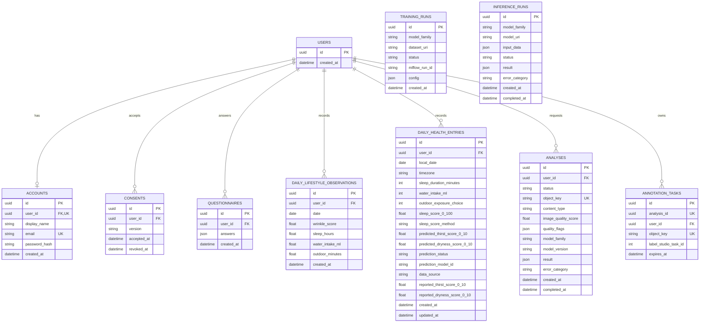

# ER Diagram — ฐานข้อมูลปัจจุบัน

อ้างอิง SQLAlchemy models ใน [`backend/core/db/models.py`](../../backend/core/db/models.py) ไม่ใช่ schema ที่เสนอไว้ในเอกสารออกแบบเดิม

`PK` คือ primary key, `FK` คือ foreign key, `UK` คือ unique key. ความสัมพันธ์ทั้งหมดที่ลากเส้นอยู่ในแผนภาพมี foreign key ไปยัง `users.id` จริง ส่วน `training_runs` และ `inference_runs` ไม่มี foreign key ไปยังตารางอื่น

- `accounts.user_id` เป็น unique: ผู้ใช้หนึ่งคนมีบัญชีได้ไม่เกินหนึ่งบัญชี และผู้ใช้ที่สร้างแบบไม่สมัครอาจไม่มีบัญชี
- `daily_lifestyle_observations` บังคับ unique `(user_id, date)`; `daily_health_entries` บังคับ unique `(user_id, local_date)`
- `annotation_tasks.analysis_id` อ้างถึง `analyses.id` ในโค้ดและเป็น unique แต่ **ไม่ได้ประกาศ foreign key** ในฐานข้อมูล จึงไม่ได้ลากเส้น FK ในภาพ
- คำตอบตอนสมัคร เช่น `outdoor_minutes` อยู่ใน `questionnaires.answers` (JSON); ข้อมูลรายวันใน `daily_health_entries` ใช้ `outdoor_exposure_choice` (ช่วงเวลา 1–4) แทนจำนวนนาที
- ภาพและ artifacts อยู่ใน MinIO โดยตาราง `analyses` และ `annotation_tasks` เก็บเพียง `object_key`
