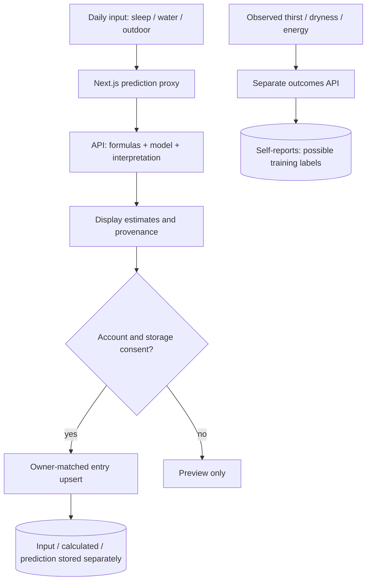

# Daily Health Input Flow

ตรวจเทียบ routes, services และ frontend วันที่ 6 ตุลาคม 2026

## กรอกและบันทึก

หน้า `/clients` ส่งวันท้องถิ่น เวลานอน น้ำดื่ม และตัวเลือกกลางแจ้งไป Next.js `/api/daily-health/predict` แล้ว proxy ไป `POST /api/v1/daily-health/predict` ด้วย service Basic credentials ผู้ใช้ preview ได้โดยไม่เข้าสู่ระบบ แต่การบันทึกต้องมี signed account session, Bearer token ที่ตรงเจ้าของ และ daily-health storage consent

Entry เป็น upsert `(user_id, local_date)` หนึ่งรายการต่อบัญชีต่อวัน Prediction ไม่สำเร็จยังเก็บ input ได้ การบันทึกไม่ทำให้ prediction กลายเป็น observed outcome

## ผลที่ต้องแยกกัน

| ผล | ที่มา / ข้อจำกัด |
| --- | --- |
| Sleep score | สูตรเวลานอนเต็มที่ 540 นาที; ไม่ใช่ sleep-quality model |
| Hydration / thirst field เดิม | สูตร shortfall เทียบกับน้ำหนักที่ consent active; ไม่ใช่ perceived thirst forecast |
| Dryness | Synthetic baseline หรือ approved real-outcome candidate; แสดง model ID, horizon และ domain |
| Next-day thirst / energy | Experimental numeric self-report estimates จาก approved intact candidate เท่านั้น; ไม่มีโมเดลให้ `model_not_ready`; OOD งดผล; two-target candidate ไม่มี energy |
| Personal sleep/water forecast | ประวัติบัญชีเดียวและ forecast consent แยก; ไม่ใช่ shared outcome model |
| Profile guidance | Self-reported age/smoking/menstrual/skin type ภายใต้ consent ของส่วนนั้น; ไม่ใช่ผลตรวจจากภาพ |
| Acne | ถูกถอดออกจาก prediction/UI; ไม่แสดง legacy field ในประวัติ |

Next-day result มี signed receipt อายุสองชั่วโมงผูกกับวันและ input Server ตรวจ receipt ก่อนเก็บใน `next_day_forecasts` ไม่เชื่อ forecast numbers จาก browser ไม่คำนวณทับ historical rows

## Outcomes, consent และประวัติ

ผู้ใช้บันทึก self-reported thirst/dryness/energy 0–10 ผ่าน `/api/daily-health/outcomes` ค่าที่ไม่มีไม่แทนด้วยศูนย์ Training opt-in แยกจาก storage: v1 รองรับ thirst/dryness, v2 รวม energy; UI เสนอ v2 แบบไม่ติ๊กให้เอง การบันทึก outcome ไม่สั่ง train ทันที

Dashboard และ `/trend` อ่าน entries ของบัญชีเดียว ผลที่บันทึกไว้ต้องคง provenance และไม่เปลี่ยน prediction เป็น actual Withdrawal ของ training ไม่ลบ daily history; explicit data deletion ลบ health data และ reset user-trained registry/artifacts ตาม [Training Pipeline](Daily-Health-Training-Pipeline.md)

น้ำหนัก/ส่วนสูง, age guidance, personalization, skin type, menstrual check-ins และ personal forecast มี consent/cleanup ตาม route ของแต่ละส่วน ไม่ใช้ image/annotation consent แทน

## Source map

- [API routes](../../backend/api/v1/routes/daily_health.py)
- [Next.js prediction proxy](../../frontend/src/app/api/daily-health/predict/route.ts)
- [Daily model](../../models/time-series/non-linear-model/daily_score_model.py)
- [Personal forecast](../../backend/services/daily_health_personal_forecast.py)
- [Model summary](Lifestyle-Model-Summary.md), [Training Pipeline](Daily-Health-Training-Pipeline.md)
