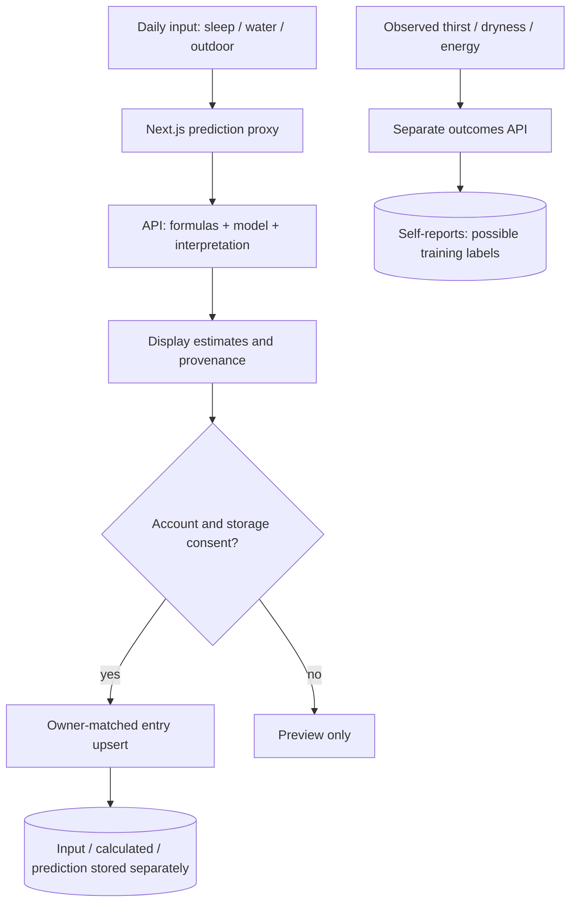

# ขั้นตอนกรอกข้อมูลสุขภาพรายวัน

ตรวจเทียบ route, service และ frontend วันที่ 6 ตุลาคม 2026

## กรอกและบันทึก

หน้า `/clients` ส่งวันที่ท้องถิ่น เวลานอน น้ำดื่ม และตัวเลือกกลางแจ้งไป Next.js `/api/daily-health/predict` แล้ว proxy ไป `POST /api/v1/daily-health/predict` ด้วยข้อมูลรับรอง Basic ของบริการ ผู้ใช้ดูตัวอย่างได้โดยไม่เข้าสู่ระบบ แต่การบันทึกต้องมี session บัญชีที่ลงลายเซ็น Bearer token ที่ตรงเจ้าของ และความยินยอมเก็บ Daily Health

บันทึกด้วย upsert `(user_id, local_date)` หนึ่งรายการต่อบัญชีต่อวัน หากทำนายไม่สำเร็จยังเก็บข้อมูลเข้าได้ การบันทึกไม่ทำให้ค่าทำนายกลายเป็นผลที่สังเกตจริง

## ผลที่ต้องแยกกัน

| ผล | ที่มา / ข้อจำกัด |
| --- | --- |
| คะแนนเวลานอน | สูตรเวลานอนเต็มที่ 540 นาที; ไม่ใช่โมเดลคุณภาพการนอน |
| field น้ำดื่ม / ความกระหายเดิม | สูตรส่วนขาดเทียบน้ำหนักที่ยังมีความยินยอม; ไม่ใช่พยากรณ์ความกระหายตามความรู้สึก |
| ผิวแห้ง | โมเดลอ้างอิงสังเคราะห์หรือ candidate จากผลจริงที่อนุมัติแล้ว; แสดงรหัสโมเดล ระยะพยากรณ์ และขอบเขตข้อมูล |
| ความกระหาย / พลังงานวันถัดไป | ค่าประมาณทดลองของคะแนนที่ผู้ใช้รายงาน จาก candidate ที่อนุมัติและสมบูรณ์เท่านั้น; ไม่มีโมเดลให้ `model_not_ready`; งดผลนอกขอบเขตข้อมูล (OOD); candidate สองเป้าหมายไม่มีพลังงาน |
| พยากรณ์เวลานอน/น้ำดื่มเฉพาะบุคคล | ใช้ประวัติบัญชีเดียวและความยินยอมพยากรณ์แยก; ไม่ใช่โมเดลผลลัพธ์ร่วม |
| คำแนะนำจากโปรไฟล์ | อายุ/การสูบบุหรี่/ประจำเดือน/ชนิดผิวที่ผู้ใช้รายงาน ภายใต้ความยินยอมส่วนนั้น; ไม่ใช่ผลตรวจภาพ |
| สิว | ถอดจากการทำนาย/UI แล้ว; ไม่แสดง field เดิมในประวัติ |

ผลวันถัดไปมีหลักฐานผลที่ลงลายเซ็น อายุสองชั่วโมง ผูกกับวันและข้อมูลเข้า server ตรวจหลักฐานก่อนเก็บใน `next_day_forecasts` ไม่เชื่อตัวเลขพยากรณ์จากเบราว์เซอร์ และไม่คำนวณทับแถวประวัติ

## ผลที่รายงาน ความยินยอม และประวัติ

ผู้ใช้บันทึกความกระหาย/ผิวแห้ง/พลังงานที่รายงานเอง 0–10 ผ่าน `/api/daily-health/outcomes` ค่าที่ไม่มีไม่แทนศูนย์ ความยินยอมฝึกแยกจากการเก็บ: v1 รองรับความกระหาย/ผิวแห้ง ส่วน v2 รวมพลังงาน UI เสนอ v2 โดยไม่เลือกให้เอง การบันทึกผลไม่สั่งฝึกทันที

dashboard และ `/trend` อ่านรายการของบัญชีเดียว ผลที่บันทึกต้องคงที่มาและไม่เปลี่ยนค่าทำนายเป็นค่าจริง การถอนความยินยอมฝึกไม่ลบประวัติรายวัน; การลบข้อมูลอย่างชัดเจนลบข้อมูลสุขภาพและรีเซ็ต registry/artifact ที่ฝึกจากผู้ใช้ตาม [ขั้นตอนฝึกโมเดล](Daily-Health-Training-Pipeline.md)

น้ำหนัก/ส่วนสูง คำแนะนำตามวัย การปรับเฉพาะบุคคล ชนิดผิว การบันทึกประจำเดือน และพยากรณ์เฉพาะบุคคล มีความยินยอม/การล้างข้อมูลตาม route แต่ละส่วน ไม่ใช้ความยินยอมภาพ/annotation แทน

## แผนผังซอร์ส

- [route API](../../backend/api/v1/routes/daily_health.py)
- [proxy ทำนายของ Next.js](../../frontend/src/app/api/daily-health/predict/route.ts)
- [โมเดลรายวัน](../../models/time-series/non-linear-model/daily_score_model.py)
- [พยากรณ์เฉพาะบุคคล](../../backend/services/daily_health_personal_forecast.py)
- [สรุปโมเดล](Lifestyle-Model-Summary.md), [ขั้นตอนฝึกโมเดล](Daily-Health-Training-Pipeline.md)
