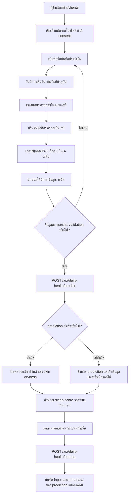
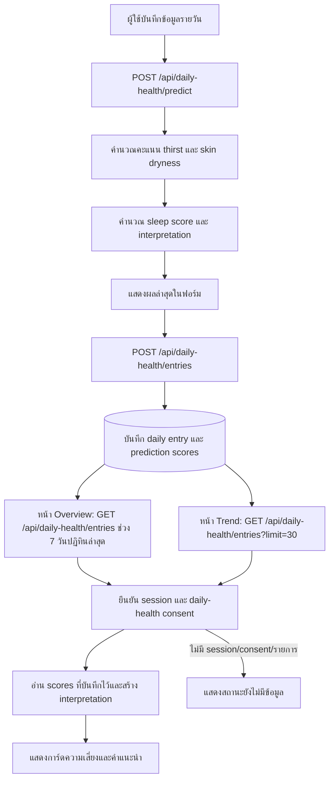
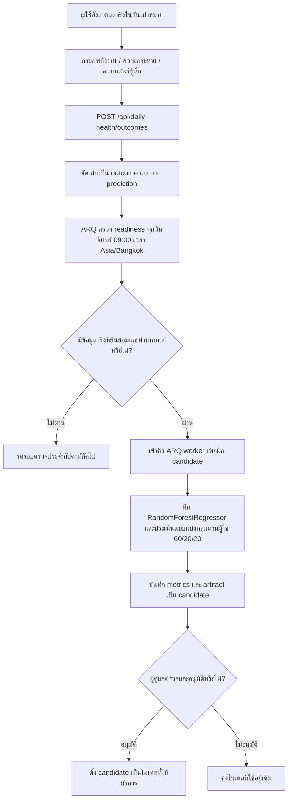

# Daily Health Input Flow

เอกสารนี้สรุปลำดับการกรอกข้อมูลสุขภาพรายวัน การเรียกผลประเมิน และวงจรเก็บผลที่ผู้ใช้รายงานจริง ตาม implementation ปัจจุบัน

## 1. กรอกข้อมูลรายวันและดูผล

### ข้อมูลและกติกาของฟอร์ม

| ข้อมูล | วิธีกรอก/การตรวจสอบ |
|---|---|
| วันที่ | เริ่มต้นเป็นวันที่ปัจจุบัน และไม่อนุญาตวันที่ในอนาคต |
| เวลานอน | แยกช่องชั่วโมงและนาที; ระยะเวลารวมสูงสุด 600 นาที (10 ชั่วโมง) |
| น้ำดื่ม | ปริมาณหน่วย ml |
| น้ำหนัก | ไม่มีช่องในฟอร์มรายวัน; อ่านจากน้ำหนักที่ผู้ใช้บันทึกในโปรไฟล์ภายใต้ consent แยก และเก็บเป็น snapshot ในรายการของวันนั้น; ถ้าไม่มีน้ำหนักที่ยินยอม ระบบจะไม่คำนวณ thirst score |
| เวลาอยู่กลางแจ้ง | เลือกหมวด 1–4; ส่งรหัสตัวเลขให้ API |
| ความยินยอมบันทึก | ต้องยินยอมก่อนส่งข้อมูล |
| Personalization / skin-type guidance / age guidance / model training | ความยินยอมแยกกันและเป็นตัวเลือก; ส่งเฉพาะข้อมูลที่ผู้ใช้ยินยอม ชนิดผิวที่เลือกเองใช้สร้างคำแนะนำดูแลผิวทั่วไป ไม่เป็น feature หรือ target ของโมเดล |

ส่วนสูงและน้ำหนักกำหนดหรือแก้ไขได้ที่หน้า `/profile` ไม่ต้องกรอกซ้ำในฟอร์มรายวัน; แต่ละค่าใช้ consent แยกกัน (`daily-health-height-profile-v1` และ `daily-health-weight-profile-v1`). น้ำหนักใช้คำนวณเกณฑ์น้ำดื่มและ thirst score พร้อม snapshot ต่อวัน; เมื่อถอน consent น้ำหนัก ระบบลบน้ำหนักและคะแนน thirst ตามสูตรที่คำนวณจากค่านั้น ส่วนสูงเก็บไว้ในโปรไฟล์เท่านั้น ไม่ใช้คำนวณคะแนน

ตัวเลือก outdoor ที่ฟอร์มและ backend ใช้อยู่ปัจจุบันคือ 1: น้อยกว่า 60 นาที, 2: 60 ถึงน้อยกว่า 180 นาที, 3: 180 ถึงน้อยกว่า 240 นาที และ 4: ตั้งแต่ 240 นาทีขึ้นไป โดยส่งเป็นรหัส `1–4` ไม่ใช่จำนวนนาทีจริง ข้อควรระวัง: หน้าแนวโน้มปัจจุบันย่อ label ของตัวเลือก 2 เป็น “1–2 ชั่วโมง” ซึ่งไม่ตรงกับช่วงที่ฟอร์มรับจริง (“1–น้อยกว่า 3 ชั่วโมง”); ควรทำให้ label สองหน้าตรงกันก่อนใช้ค่ากลางแจ้งเพื่ออธิบายแนวโน้ม

### ผลที่คำนวณและ prediction

- `sleep_score_0_100` คำนวณจากระยะเวลานอน: `round(min(100, sleep_duration_minutes / 540 * 100), 1)` โดยใช้ 9 ชั่วโมงเป็นเพดานคะแนน 100; เป็นคะแนนจากระยะเวลา ไม่ใช่คุณภาพการนอน
- `thirst_score_0_10` คำนวณจากน้ำดื่มเทียบกับน้ำหนักในโปรไฟล์ที่ยังได้รับ consent; daily form ไม่รับน้ำหนักซ้ำ และฐานข้อมูลเก็บค่าที่ใช้เป็น snapshot ต่อวัน
- โมเดลประเมิน `thirst_score_0_10` และ `skin_dryness_score_0_10` พร้อมผลตีความ/คำแนะนำตาม response ของระบบ
- serving จะใช้ candidate ที่ได้รับอนุมัติเมื่อมี deployment ที่ active; หากไม่มี ระบบใช้โมเดลพื้นฐาน
- หาก prediction ล้มเหลว frontend ยังพยายามบันทึก daily entry โดยไม่มี prediction scores
- การบันทึก entry เป็น upsert ตามผู้ใช้และวันที่ท้องถิ่น จึงมีรายการรายวันได้หนึ่งรายการต่อผู้ใช้ต่อวัน
- ค่าที่โมเดลทำนายเป็นเพียง prediction ไม่ใช่ผลที่ผู้ใช้รายงานจริง และไม่ถูกนำไปใช้เป็น training label

### การตีความความเสี่ยงในผลรายวัน

หลังคำนวณคะแนน ระบบสร้าง `interpretation` สำหรับแสดงความเสี่ยงและคำแนะนำ โดยแยกสัญญาณที่ประเมินได้ออกจากสัญญาณที่ยังมีข้อมูลไม่พอ:

| สัญญาณบนหน้าเว็บ | วิธีแสดง/ข้อจำกัดปัจจุบัน |
|---|---|
| สุขภาพโดยรวม (`daily_health_summary`) | ระดับต่ำ/ปานกลาง/สูง พร้อมปัจจัยและคำแนะนำจากเวลานอนและคะแนน thirst/dryness; หาก input อยู่นอกช่วงฝึกจะไม่จัดระดับ |
| ผิวแห้งและการดูแลผิว (`skin_care_attention_level`) | ระดับความใส่ใจจากคะแนน dryness และ thirst ที่บันทึกไว้; ไม่ใช่การวินิจฉัย |
| สัญญาณสิว (`acne_flare_signal`) | ยังไม่จัดระดับ (`insufficient_data`) เพราะยังไม่มีป้ายผลสิวที่ผู้ใช้รายงานจริง |
| พลังงานวันถัดไป (`low_energy_signal`) และกระหายน้ำวันถัดไป (`thirst_attention`) | ปัจจุบันยังแสดง `insufficient_history` เสมอ แม้มีช่อง self-report พลังงาน เพราะ training targets ของโมเดลมีเฉพาะ thirst และ skin dryness และยังไม่มี logic ใช้ประวัติ outcome เพื่อให้สองสัญญาณนี้เป็นระดับความเสี่ยง |
| คำแนะนำตามข้อมูลส่วนตัว (`profile_guidance`) | แสดงเมื่อมี consent แยกที่เกี่ยวข้อง เช่น บุหรี่ ประจำเดือน หรือชนิดผิวที่ผู้ใช้เลือกเอง; ข้อมูลช่วงวัยใช้ปรับแนวทางเวลานอนเมื่อได้รับ age-guidance consent; ชนิดผิวเปลี่ยนเฉพาะข้อความคำแนะนำ ไม่เปลี่ยนคะแนนหรือระดับความเสี่ยง |

ผู้ใช้สามารถเลือกประเภทผิวที่รายงานด้วยตนเองได้หนึ่งแบบ: ธรรมดา, แห้ง, มัน, ผสม, แพ้ง่าย หรือไม่ระบุ ภายใต้ skin-type guidance consent แยกต่างหาก; API เก็บชนิดผิวปัจจุบันใน `daily_health_profiles` และสร้าง `profile_guidance` พร้อมลิงก์คำแนะนำจาก American Academy of Dermatology ตามประเภทที่เลือก ข้อความเป็นแนวทางดูแลทั่วไป ไม่ใช่ผลตรวจผิวหรือคำวินิจฉัย และไม่นำชนิดผิวไปคิดคะแนนหรือใช้เป็น feature ของโมเดล

หากสัญญาณไม่มีระดับ ระบบแสดงสถานะข้อมูลไม่พอ/ประเมินไม่ได้แทนการใส่ระดับต่ำ กลาง หรือสูงโดยคาดเดา ความเสี่ยงและคำแนะนำเป็นแนวทางทั่วไป ไม่ใช่การวินิจฉัยโรค

### การอ่านผลบนหน้า Overview และ Trend

- `GET /api/daily-health/entries` ใช้ session cookie ของผู้ใช้; Next.js ส่งต่อคำขอไป backend โดยเก็บ Basic credentials ไว้ฝั่ง server
- Backend ตรวจว่าผู้ใช้และ daily-health consent ยังใช้งานได้ก่อนคืนประวัติ; หากไม่มี consent หรือไม่มีรายการ จะคืน `items: []`
- Overview ขอข้อมูล 7 วันปฏิทินล่าสุดตาม `Asia/Bangkok`; Trend ขอรายการย้อนหลังไม่เกิน 30 รายการ
- Overview แสดงรายการรายวันในช่วงนั้น พร้อมค่าเฉลี่ย sleep duration, sleep score, น้ำดื่ม, thirst score และ dryness score; แต่ละค่าเฉลี่ยคำนวณจากค่าที่มีจริงเท่านั้นและแสดงจำนวนวันที่มีข้อมูล จึงไม่นับวันที่ไม่มีบันทึกเป็นศูนย์
- หน้าเหล่านี้ใช้ thirst/dryness scores ที่บันทึกไว้เพื่อสร้างคำอธิบายความเสี่ยงใหม่ แต่ **ไม่เรียกโมเดลทำนายซ้ำ** และไม่สร้างข้อมูลแทนวันที่ไม่มีรายการ
- ประวัติ smoking, age band, skin type และ menstrual check-in จะนำมาใช้เฉพาะเมื่อ consent ของข้อมูลประเภทนั้นยัง active; skin type เก็บเป็นค่าปัจจุบันใน `daily_health_profiles` ส่วน menstruation เป็น check-in แยกตามวัน
- Risk cards ทั้งสองหน้าใช้ชุดสัญญาณเดียวกัน: สุขภาพโดยรวม, การดูแลผิว/ผิวแห้ง, สัญญาณสิว, พลังงานวันถัดไป และความกระหายน้ำวันถัดไป พร้อมคำแนะนำตามข้อมูลส่วนตัวเมื่อมีสิทธิ์ใช้ข้อมูล

## 2. ผลที่ผู้ใช้รายงานจริงและการฝึกโมเดล

เงื่อนไขการจับคู่และฝึก:

1. บันทึกผลจริงผ่านฟอร์ม optional self-report; วันเป้าหมายต้องไม่อยู่ในอนาคต
2. การจับคู่ใช้ lifestyle input ของวันก่อนหน้า กับ thirst และ dryness ที่ผู้ใช้รายงานสำหรับวันเป้าหมายเดียวกัน และต้องเป็นผู้ใช้คนเดียวกัน
3. ต้องมีความยินยอมฝึกโมเดลที่ยัง active; ต้องมีตัวอย่างที่จับคู่ได้อย่างน้อย 100 รายการจากผู้ใช้อย่างน้อย 5 คนก่อนเข้าฝึก
4. ARQ ตรวจความพร้อมทุกวันจันทร์ เวลา 09:00 น. `Asia/Bangkok`; การส่ง outcome จะไม่เริ่มฝึกทันที
5. ต้องมีอย่างน้อย 100 คู่จากผู้ใช้อย่างน้อย 5 คน และ candidate รุ่นถัดไปจะพิจารณาเมื่อมีตัวอย่างใหม่เพิ่มอย่างน้อย 25 รายการจาก candidate ก่อนหน้า
6. การฝึกทำงานแบบ asynchronous ผ่าน ARQ; ผลที่ได้เป็น candidate เพื่อให้ผู้ดูแลตรวจสอบและอนุมัติ ไม่ถูก deploy อัตโนมัติ และจะไม่มี candidate ใหม่หากข้อมูลยังไม่ถึงเกณฑ์
7. train/validation/test แบ่งตามผู้ใช้เพื่อไม่ให้คนเดียวกันกระจายข้ามชุด; prediction score ไม่ใช้เป็น label และ synthetic data ไม่อยู่ในชุดฝึกของ user candidate

## 3. เส้นทาง API

| การทำงาน | API ที่หน้าเว็บเรียก | API ภายใน backend |
|---|---|---|
| Prediction | `POST /api/daily-health/predict` | `POST /api/v1/daily-health/predict` |
| บันทึก daily entry | `POST /api/daily-health/entries` | `PUT /api/v1/daily-health/users/{user_id}/entries` |
| อ่านสรุป 7 วันสำหรับ Overview | `GET /api/daily-health/entries?limit=7&from_date=YYYY-MM-DD&to_date=YYYY-MM-DD` | `GET /api/v1/daily-health/users/{user_id}/entries?limit=7&from_date=YYYY-MM-DD&to_date=YYYY-MM-DD` |
| อ่านประวัติสำหรับ Trend | `GET /api/daily-health/entries?limit=30` | `GET /api/v1/daily-health/users/{user_id}/entries?limit=30` |
| บันทึกผลจริง | `POST /api/daily-health/outcomes` | `PUT /api/v1/daily-health/users/{user_id}/outcomes` |

API route ฝั่ง frontend ใช้ session ของผู้ใช้และส่งต่อไปยัง backend; credentials สำหรับ backend ไม่ได้ส่งจาก browser โดยตรง
