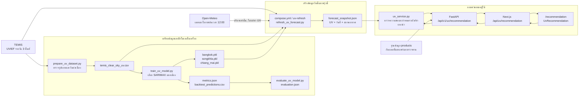

# การทำงานของโมเดลทำนาย UV

อัปเดต 2 ตุลาคม 2026: โมเดลใช้งานเลือกผ่าน registry และ training สร้าง candidate แยกเสมอ รายละเอียด เกณฑ์คุณภาพ, monitoring, promotion/rollback และสถานะส่งมอบอยู่ใน [รายงาน UV MLOps](uv-mlops-report.md)

เอกสารนี้อธิบายโค้ดที่ใช้งานอยู่สำหรับกรุงเทพมหานคร สงขลา และเชียงใหม่ โมเดลทำนาย **ดัชนี UV ภายใต้ท้องฟ้าโปร่ง ณ เที่ยงสุริยะ** (`UVIEF`) ของแต่ละพื้นที่ ไม่ได้ทำนาย UV ที่ผู้ใช้ได้รับจริงหรือ UV หลังผลของเมฆ ระบบดาวน์โหลดข้อมูลดิบผ่าน HTTP ได้ แต่ฝึกและเรียกใช้โมเดล SARIMAX ในระบบของเราเอง ไม่ได้เรียก API โมเดลทำนายของผู้ให้บริการอื่น

## ภาพรวมการไหลของข้อมูล



## ไฟล์ไหนทำอะไร

| ขั้น | ไฟล์ | หน้าที่และผลลัพธ์ |
| --- | --- | --- |
| ตรวจข้อมูลดิบ | [`scripts/prepare_uv_dataset.py`](../scripts/prepare_uv_dataset.py) | ดาวน์โหลดไฟล์ TEMIS สามพื้นที่ ตรวจหัวคอลัมน์ `UVIEF`, จำนวน 17 คอลัมน์, วันที่ต่อเนื่องและค่าที่ถูกต้อง แล้วรวมเป็น CSV; ค่า `-1` ถูกบันทึกเป็นค่าว่าง ไม่เดาข้อมูลแทน |
| ข้อมูลฝึก | `storage/data/uv/temis_clear_sky_uv.csv` | ข้อมูลรายวัน `date`, `city`, `uv_index_clear_sky`, `uv_index_uncertainty`; สร้างใหม่ได้และไม่เก็บใน Git |
| ฝึกและ backtest | [`scripts/train_uv_model.py`](../scripts/train_uv_model.py) | สร้าง Fourier features, ทดลอง SARIMAX สี่ order, เลือกจาก validation, ทดสอบกับช่วงเวลาที่กันไว้ แล้วฝึกโมเดลสุดท้ายแยกเมือง |
| ตัวโมเดล | `storage/models/uv/versions/<version>/models/{bangkok,songkhla,chiang_mai}.pkl` | สถานะ SARIMAX ที่ฝึกแล้วสำหรับแต่ละเมือง สร้างโดย `train_uv_model.py`; เป็น immutable bundle ในเครื่อง ไม่อยู่ใน Git; `active.json` ชี้รุ่นใช้งาน |
| ผลฝึก | `storage/models/uv/versions/<version>/artifacts/metrics.json` และ `backtest_predictions.csv` | เก็บ order ที่เลือก, คะแนนแต่ละช่วง, checksum ของ CSV และค่าพยากรณ์ย้อนหลัง |
| ประเมิน | [`scripts/evaluate_uv_model.py`](../scripts/evaluate_uv_model.py) | ตรวจ checksum/จำนวนแถว/MAE ของชุดทดสอบ สรุปความคลาดเคลื่อน การพลาดระดับ UV ≥8/≥11 และช่วงความไม่แน่นอนแบบ block bootstrap ลง `evaluation.json` |
| ดูกราฟ | [`models/time-series/uv/uv_model_evaluation.ipynb`](../models/time-series/uv/uv_model_evaluation.ipynb) | Notebook สำหรับแสดงผลประเมินและกราฟ; ไม่ใช่โค้ดที่ API ใช้พยากรณ์ทุกคำขอ |
| อัปเดตรายวัน | [`scripts/refresh_uv_forecast.py`](../scripts/refresh_uv_forecast.py) | ดาวน์โหลด TEMIS ใหม่ โหลดโมเดล active ที่ตรวจ checksum แล้ว เพิ่มข้อมูลใหม่เข้า state ในหน่วยความจำโดยไม่แก้ bundle ขอเมฆและฝนจาก Open-Meteo แล้วเขียน snapshot วันนี้กับพรุ่งนี้แบบแทนที่ไฟล์ครั้งเดียว |
| ตั้งรอบอัปเดต | [`compose.yml`](../compose.yml) บริการ `uv-refresh` | รัน refresh ทุก 6 ชั่วโมงเมื่อสำเร็จ; หากล้มเหลวลองใหม่หลัง 30 นาที API อ่าน snapshot จาก volume ที่แชร์แบบอ่านอย่างเดียว |
| ผลสำหรับ API | `storage/artifacts/uv/forecast_snapshot.json` | JSON รวม `generated_at` และข้อมูลแต่ละเมือง ได้แก่ `data_date`, `model_version`, `days` และสภาพอากาศ; เป็นไฟล์ที่สร้างขึ้น ไม่อยู่ใน Git |
| ตรวจและแปลผล | [`backend/services/uv_service.py`](../backend/services/uv_service.py) | อ่าน snapshot ตรวจอายุ/วันที่/ตัวเลข UV กำหนดระดับ UV และลำดับความสำคัญในการป้องกัน พร้อมข้อความวิธีใช้กันแดด |
| Backend API | [`backend/api/v1/routes/uv.py`](../backend/api/v1/routes/uv.py), [`backend/api/v1/router.py`](../backend/api/v1/router.py) | รับ `city`, เรียก service และดึงสินค้า sunscreen ที่เผยแพร่ ตรวจทาน และตรงเกณฑ์จากฐานข้อมูล; route ใช้ Basic authentication สำหรับการเรียกจาก Next.js server |
| ข้อมูลสินค้า | [`backend/core/db/models.py`](../backend/core/db/models.py) (`Product`), [`scripts/seed_uv_products.py`](../scripts/seed_uv_products.py) | กำหนดฟิลด์สินค้าและเพิ่มตัวอย่างที่ตรวจแหล่งข้อมูลแล้ว; สินค้าไม่ได้เป็นผลทำนายจาก SARIMAX |
| Next.js proxy | [`frontend/src/app/api/uv/recommendation/route.ts`](../frontend/src/app/api/uv/recommendation/route.ts) | ตรวจว่าเมืองอยู่ในสามตัวเลือก ส่งคำขอไป Backend พร้อม Basic credentials ฝั่ง server และไม่ cache ผล |
| หน้าแสดงผล | [`frontend/src/app/recommendation/page.tsx`](../frontend/src/app/recommendation/page.tsx), [`uv-recommendation.tsx`](../frontend/src/app/recommendation/uv-recommendation.tsx), [`uv.css`](../frontend/src/app/recommendation/uv.css) | ให้เลือกเมืองและวันนี้/พรุ่งนี้ แสดงตัวเลข ระดับ คำแนะนำ อากาศประกอบ และสินค้าที่ผ่านเกณฑ์; หน้าเดียวกันมีคำแนะนำส่วนบุคคลอีกส่วนซึ่งเป็นคนละระบบกับ UV |
| เฝ้าระวัง | [`backend/api/v1/routes/monitoring.py`](../backend/api/v1/routes/monitoring.py) | `/api/v1/monitoring/uv` ตรวจทั้งสามเมืองและรายงานวันที่ข้อมูล วันสร้างผล รุ่นโมเดล และการมีข้อมูลอากาศ |

## โมเดลคำนวณอย่างไร

1. **ตัวแปรเป้าหมาย:** `uv_index_clear_sky` ของเมืองและวันที่นั้นจาก TEMIS เท่านั้น ข้อมูลเมฆ/ฝนไม่ใช่ label หรือ feature ของโมเดลนี้
2. **ฤดูกาล:** `fourier()` สร้าง `sin` และ `cos` ของรอบปี 365.2425 วันสำหรับ harmonic ลำดับ 1 และ 2 รวม 4 ตัวแปรที่ทราบล่วงหน้าจากวันที่
3. **ความต่อเนื่องของเวลา:** SARIMAX ใส่ Fourier เป็น `exog` และเรียนรู้ความสัมพันธ์ของค่าที่เหลือในอดีต มี intercept (`trend="c"`) และไม่ทำ differencing (`d=0`) ทดลอง `order` `(1,0,0)`, `(2,0,0)`, `(3,0,0)`, `(1,0,1)` แยกกันสำหรับแต่ละเมือง
4. **เลือกโมเดล:** คำสั่ง standalone ใช้ split เดิม: ฝึกด้วยข้อมูลถึง 2023-12-31, เลือก `order` ที่ MAE ของการทำนายล่วงหน้า **2 วัน** ต่ำสุดในปี 2024, แล้วใช้ข้อมูลตั้งแต่ 2025-01-01 เป็นชุดทดสอบที่ไม่ใช้เลือก `order` การ backtest เลื่อนจุดพยากรณ์ไปทีละวันและเติมเฉพาะค่าจริงที่ถึงวันนั้นแล้ว
   สำหรับ `uv_mlops.py pipeline` split ถูกกำหนดใหม่ตาม cutoff พารามิเตอร์ของ incumbent: validation 365 วันก่อน holdout และ holdout หลัง cutoff เท่านั้น ดูรายละเอียดในรายงาน MLOps
5. **ไฟล์ใช้งานจริง:** หลังประเมิน `train_uv_model.py` ฝึก `order` ที่เลือกด้วยข้อมูลทั้งหมดของเมืองนั้นและบันทึก `.pkl` เมื่อข้อมูล TEMIS วันใหม่มา `refresh_uv_forecast.py` เพิ่มค่าจริงเข้า state ด้วย `append(..., refit=False)` จึงอัปเดต state แต่ยังใช้พารามิเตอร์ที่ฝึกไว้; การฝึกใหม่เต็มรูปแบบใช้ `uv_mlops.py pipeline` เพื่อสร้าง candidate แล้วผ่าน gate/approval ก่อนเปลี่ยนรุ่น; ไฟล์ใน active bundle ไม่ถูกแก้ระหว่าง refresh

Snapshot ของโมเดลพยากรณ์ทั้งวันนี้และพรุ่งนี้เป็น `SARIMAX forecast` โดยใช้ observation ถึงเมื่อวาน หาก TEMIS มีค่าของวันนี้แล้ว ระบบตัดค่าของวันนี้ออกจาก state ที่ใช้ forecast ระบบไม่เผยแพร่ค่าที่ต้องทำนายไกลกว่าขอบเขต 2 วันที่ทดสอบไว้

## เมื่อผู้ใช้เปิดหน้าแนะนำ

1. `UvRecommendation` เรียก `/api/uv/recommendation?city=...` ผ่าน Next.js proxy; ผู้ใช้เลือกได้เฉพาะ `bangkok`, `songkhla`, `chiang_mai`
2. Proxy ส่งคำขอไป `/api/v1/uv/recommendation` ด้วย credentials ของบริการที่เก็บบน server
3. `load_recommendation()` อ่าน snapshot และปฏิเสธเมื่อไฟล์หาย/ผิดรูปแบบ, สร้างเกิน 8 ชั่วโมง, ข้อมูล TEMIS เก่ากว่าเมื่อวาน, วันในผลไม่ตรงวันนี้/พรุ่งนี้ หรือค่า UV ไม่ใช่ตัวเลข 0–25; Backend ตอบ HTTP 503 ในกรณีเหล่านี้
4. Service กำหนดระดับจากค่า UV: `<3` ต่ำ, `3–<6` ปานกลาง, `6–<8` สูง, `8–<11` สูงมาก, `≥11` สูงสุดขีด; ที่ `≥8` เน้นหลีกเลี่ยงแดดเที่ยง, ที่ `3–<8` เน้นหาที่ร่ม ส่วนวิธีใช้กันแดด broad-spectrum SPF 30+ และทาซ้ำอย่างน้อยทุก 2 ชั่วโมงกลางแจ้งแสดงเสมอ
5. API เพิ่มสินค้าไม่เกิน 5 รายการที่เป็น `sunscreen`, `published`, มี `reviewed_at`, SPF ≥30, `broad_spectrum=true` และ `source_url`; เรียงตามแบรนด์/ชื่อ **รายการสินค้าไม่ได้จัดอันดับตามค่าพยากรณ์หรือข้อมูลผิวของผู้ใช้**
6. หน้าเว็บแสดงวันที่ แหล่งข้อมูล (`value_kind`), `data_date`, `generated_at`, `model_version`, สภาพอากาศประกอบ และคำเตือนว่าเป็น UV ภายใต้ท้องฟ้าโปร่ง หาก Open-Meteo ใช้ไม่ได้ `weather` ว่าง แต่ค่า UV และคำแนะนำยังทำงาน

## คำสั่งที่เกี่ยวข้อง

รันจากโฟลเดอร์หลักของโครงการ:

```powershell
python scripts/uv_mlops.py status
python scripts/uv_mlops.py pipeline
# ตรวจ gate และอนุมัติด้วย promote ตามคู่มือก่อนใช้ candidate
docker compose --profile background --profile uv-training up -d --build uv-refresh uv-training
```

รายละเอียดการติดตั้ง การติดตาม และข้อจำกัดด้านแหล่งข้อมูลอยู่ใน [คู่มือการใช้งาน UV](uv-implementation.md) และ [รายงานข้อมูล/ผลประเมิน](uv-data-feasibility.md) ชุดทดสอบที่ตรวจแต่ละชั้นอยู่ใน `tests/test_prepare_uv_dataset.py`, `test_train_uv_model.py`, `test_evaluate_uv_model.py` และ `test_uv_service.py`
